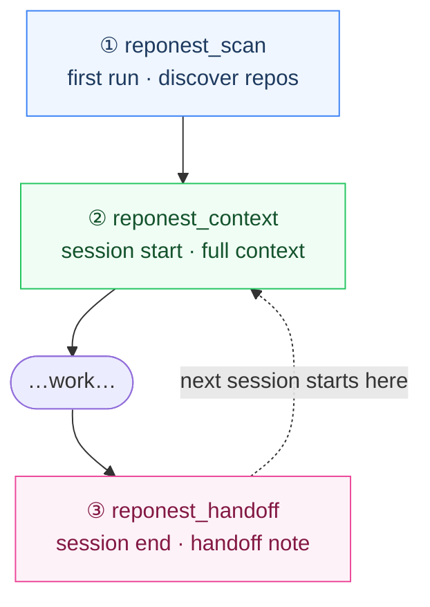
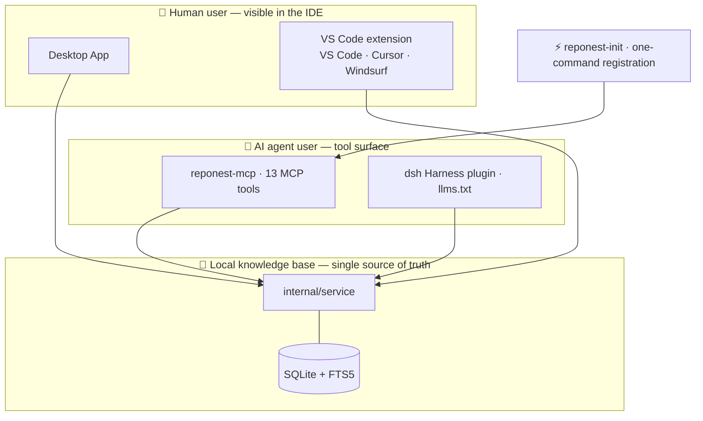

<p align="center">
  
</p>

# RepoNest: Local Git Knowledge Base

**The local-first memory layer for AI coding agents.** Your agents (Claude Code, Cursor, OpenCode...) read code brilliantly and forget everything the moment the session ends — why a decision was made, what gotcha was discovered, what to do next. RepoNest keeps that knowledge on your machine, searchable, and hands it back to *any* agent in one tool call.

English | [简体中文](README.zh-CN.md)

## Table of Contents

- [Features](#features)
- [Quick Start](#quick-start)
- [VS Code Extension (preview)](#vs-code-extension-preview)
- [Building from Source](#building-from-source)
- [Project Grouping](#project-grouping)
- [Project Layout](#project-layout)
- [Naming Layers](#naming-layers)
- [Documentation](#documentation)
- [Contributing](#contributing)
- [License](#license)

The whole product is one loop — three tool calls at session boundaries, and every agent that comes after you reuses what the last one left behind:



The dashed edge is the point: handoffs are stored in local SQLite, not in any agent's private memory, so the loop closes across agents — Claude Code writes the handoff, Cursor reads it. The rest of this README is the same loop seen from the inside: how discovery and grouping work, where your data lives, and how the pieces are layered.

[](https://go.dev)
[](https://react.dev)
[](https://www.typescriptlang.org)
[](./LICENSE)

Both paths meet at one local knowledge base — the human side (desktop app, VS Code extension), the agent side (MCP tools, llms.txt), one service layer underneath, and `reponest-init` wiring the agent side in one command:



> A single-file Wails v2 desktop app (Go + React, embedded SQLite, zero CGO) for **macOS / Windows / Linux**.
> Works offline with no cloud dependency; AI reads the same local database through the independently distributed [`reponest-mcp`](#set-up-the-ai-execution-interface-reponest-mcp) MCP server.
> Switch agents without losing context: a handoff written by Claude Code is read directly by Cursor.
> For positioning priorities, feature tiers and the scope freeze, see [ADR-0006](docs/en/adr/0006-scope-freeze.md) and the [positioning brief](docs/positioning-brief.md) (Chinese).

**Why RepoNest?** Coding agents are great at reading code but don't retain *the judgment you've accumulated across these repos*: why something was designed this way, what gotcha you hit last time, what the next todo is. Each agent keeps a private memory format, so switching tools means starting from zero. RepoNest sinks all of that into a local, searchable memory layer that any agent can read and write — `reponest_context` injects it at session start, `reponest_handoff` captures it at session end, and everything in between is retrieved on demand.

## Features

> Tier legend: **Core** (completes the discover → understand → record → retrieve → AI loop) | **Support** (makes the loop legible) | **Experimental** (kept, not expanded) | **Paused** (no further investment). See [ADR-0006](docs/en/adr/0006-scope-freeze.md).

### Knowledge Base (Core)

| Feature | Description |
|---------|-------------|
| Markdown notes | Title / tags / categories (knowledge · journal · ideas · other) / pinning / cross-project moves; drafts autosave |
| Block editor | Type `/` to open the block panel and insert structured blocks — callouts, tabs, collapsibles, code, Mermaid, math, tables… drag to reorder; the output is still plain Markdown (**Experimental**: complex blocks on hold, see ADR-0006) |
| Rich rendering | highlight.js code highlighting, Mermaid diagrams, KaTeX math, GFM callouts and task lists |
| FTS5 full-text search | trigram + bm25 relevance ranking, snippet highlighting, covering notes and todos; short CJK queries automatically fall back to LIKE |
| Version history | Auto snapshot on every save; line-level diff of any version against the current one, one-click restore |
| Global search | ⌘/Ctrl+K command palette + dashboard federated search (repos / notes / todos) |

### Repository Mining (Core)

The project detail page auto-extracts: README summary, tech stack list (20+ manifest formats recognized), language LOC shares, dependency lists (npm / go.mod including block require / cargo), top contributors, activity stats, and the recent commit stream; results are cached in `repo_meta` to avoid rescanning.

### AI-Ready Interfaces (Core)

| Channel | Description |
|---------|-------------|
| MCP Server | `reponest-mcp` stdio server, 13 tools (repo scan + context injection + session handoff + note CRUD + project queries + search + two self-checks); plugs into Claude Code / Cursor and more (the only interface AI executes through) |
| `reponest_scan` | One-shot cold start: seeds default scan roots and scans synchronously to discover local Git repos. A pure-MCP install (no desktop app) can bootstrap the knowledge base |
| `reponest_context` | One call at session start loads the project's full context: tech stack / README summary / dependencies / recent commits / open todos / highly relevant notes (handoff notes first) — replaces 3-4 chained queries |
| `reponest_handoff` | Structured handoff at session end: summary / changes / decisions / gotchas / next_steps rendered into a unified template and stored; the next session (any agent) reads it automatically |
| llms.txt | `GenerateLLMsTxt` emits an LLM-oriented knowledge base overview in Markdown |
| Note export | Export any note as `.md` with YAML frontmatter |
| Knowledge importers | Bring other agents' memory in: **Claude** memory files auto-imported on startup; **Codex** / **OpenCode** sessions and **OpenClaw** / **Hermes** (Nous) global memory as **opt-in, manually-triggered** sources (allowlist-scoped; global-memory sources attach to a project you pick in Settings). Idempotent upsert. |
| Session auto-capture (M1) | On-demand capture of a project's latest Claude Code session transcript into a handoff note; a `reponest-capture` CLI covers the B-end SessionEnd-hook automation. **Off by default** (`claude_session_capture`), privacy-gated. |
| Semantic search (M3) | Optional hybrid FTS5 + vector recall (RRF-fused) with a **pluggable vector store**: local **sqlite-vec** (default, pure-Go/zero-CGO) or remote **Qdrant** / **Weaviate** (auto-falls-back to local if unreachable). **Off by default**, gated behind an A/B eval (`cmd/abeval`). See [ADR-0012](docs/adr/0012-semantic-search.md) / [ADR-0013](docs/adr/0013-vector-database-selection.md). |
| Portable memory export | `ExportMemoryJSON` emits the knowledge base as [Open Memory Protocol](https://github.com/SMJAI/open-memory-protocol)-style memory objects (provisional; OMP is pre-1.0). |
| Claude memory import | One-click idempotent import of `~/.claude/projects/*/memory/*.md` as knowledge notes (**Support**) |
| Data integrity audit | `reponest_integrity`, 6 read-only checks: FTS index drift, orphan rows, schema shape vs version stamp, scan coverage, knowledge-cache freshness, version-snapshot orphans. Index drift makes search **silently miss results** with no other mechanism to catch it — this is the only way to detect it |

### Dashboard & Stats (Support)

> The dashboard and stats serve the legibility of the core loop and are not the product's front door; the frontend default page is the knowledge base, with nav order knowledge base → dashboard → settings (see [ADR-0006](docs/adr/0006-scope-freeze.md), Chinese).

| Feature | Description |
|---------|-------------|
| Automatic repo discovery | Configure scan roots and recursively discover all Git repos; platform-adaptive defaults |
| Visual dashboard | Daily-goal progress ring, project cards, trend line charts (7 / 30 days / all), commit heatmap |
| Repo starring | Starred repos show full stat cards; unstarred repos show names only, follow on demand |
| On-demand history backfill | "Backfill history" on a starred card fetches that repo's last 365 days of daily stats |
| Smart project grouping | Auto-detects monorepos vs single repos; manual split/merge runs in a single transaction (notes and todos move with the project) |
| Workday check | Custom daily code target with alerts when unmet |
| Status bar | Live latest-commit display (repo / branch / time, 30s cache) |

### Other

| Feature | Description |
|---------|-------------|
| Plugin system | In-process Go scripts via yaegi + knowledge source importers ([knowledge sources](docs/en/plugins/overview.md); **Experimental**, platform infrastructure work paused) |
| i18n | One-click Chinese / English switch (react-i18next, zh-CN + en) |
| Single-file cross-platform | A single Go binary, no runtime dependencies |

## Quick Start

### Install

Get the latest build for your platform from [Releases](https://github.com/sky-jiangcheng/repo-nest/releases).

**Option 1: direct download**

Download the archive for your platform from Releases and run it:

| Platform | Assets |
|----------|--------|
| macOS | `reponest-darwin-arm64.dmg` / `reponest-darwin-amd64.dmg` |
| Linux | `reponest-linux-amd64.tar.gz` |
| Windows | `reponest-windows-amd64.zip` |

**Option 2: one-line install script** (desktop app + `reponest-mcp` together)

| Platform | Command | Installs to |
|----------|---------|-------------|
| macOS | `curl -fsSL https://raw.githubusercontent.com/sky-jiangcheng/repo-nest/master/scripts/install.sh \| bash` | `/Applications/RepoNest.app` + `/usr/local/bin/reponest-mcp` |
| Linux | same | `/usr/local/bin/reponest` + `/usr/local/bin/reponest-mcp` |
| Windows | `iwr -useb https://raw.githubusercontent.com/sky-jiangcheng/repo-nest/master/scripts/install.ps1 \| iex` | `%LOCALAPPDATA%\RepoNest` (added to user PATH automatically) |

macOS also ships via Homebrew (add the tap first — see [`packaging/`](packaging/README.md)):

```bash
brew tap sky-jiangcheng/repo
brew install --cask sky-jiangcheng/repo/reponest
```

Launch opens a desktop window directly (a Wails app — no browser needed):

1. First launch seeds the default scan roots automatically (HOME on macOS/Linux; all non-system drives on Windows)
2. Click **Rescan** on the dashboard to discover repos — at this point the **knowledge base is already usable**: write/search notes, hand them to AI
3. (Optional, affects dashboard stats only) star the repos you care about → **Backfill history** fetches 365 days of stats

> **Only want the AI side?** No desktop app needed: install `reponest-mcp`, then have your agent call `reponest_scan` once to bootstrap the knowledge base.

More in [Getting Started](docs/en/getting-started.md).

> **CLI tools** (opt-in, advanced): `reponest vector-init` — guided setup of the vector store (local default / remote Qdrant/Weaviate) + embedding provider; `reponest-capture` — the Claude Code SessionEnd hook target that auto-captures a closed session; `go run ./cmd/abeval -cases queries.jsonl` — the A/B gate that decides whether semantic search earns enabling. All read the same local database; see [ADR-0013](docs/adr/0013-vector-database-selection.md).

### Set Up the AI Execution Interface (`reponest-mcp`)

AI clients talk to the independently distributed `reponest-mcp` (an MCP stdio server) — **no desktop app required**; it reads the same local database. The install script above sets it up too; you can also install it standalone:

| Method | Platform | Command |
|--------|----------|---------|
| Manual (no prerequisites) | All platforms | Download `reponest-mcp-<target>.tar.gz` / `.zip` from [Releases](https://github.com/sky-jiangcheng/repo-nest/releases) |
| Homebrew | macOS | `brew tap sky-jiangcheng/repo && brew install --cask sky-jiangcheng/repo/reponest-mcp` |
| Homebrew | Linux | `brew tap sky-jiangcheng/repo && brew install sky-jiangcheng/repo/reponest-mcp` |
| Scoop | Windows | `scoop bucket add repo https://github.com/sky-jiangcheng/scoop-repo && scoop install repo/reponest-mcp` |

Then register it with your AI client — one command covers Claude Code / Cursor / VS Code / Windsurf (step one of [ADR-0009](docs/adr/0009-ide-presence.md), idempotent):

```bash
node scripts/reponest-init/index.mjs --with-hook
```

Or register Claude Code only:

```bash
claude mcp add reponest -- "$(which reponest-mcp)"
```

#### See it work in 30 seconds

After registering, one step remains on first use:

> **First use** (bootstrap the knowledge base, no desktop app needed):
> The agent calls `reponest_scan()` — seeds default scan roots and scans, returning your local repo list in one shot.

Every work session then follows this rhythm:

> **Session start** (a new agent takes over the project):
> "Continue working on the auth project."
>
> The agent calls `reponest_context({ project_name: "auth" })` — tech stack, todos, and the last session's handoff note in one call, then gets straight to work.

> **Session end** (knowledge doesn't evaporate):
> The agent calls `reponest_handoff({ project_id: 1, summary: "Finished the OAuth migration", gotchas: ["the production cookie key needs rotating"], next_steps: ["run the regression suite"] })` — the next session (even from Cursor) continues from here automatically.

Any time in between you can just ask:

> "What local projects do I have? What did I note down about auth?"

The agent chains `reponest_projects_list` → `reponest_notes_search` → `reponest_notes_read`; new conclusions go back with `reponest_notes_create`. You can also export any note as `.md` with YAML frontmatter, or generate an LLM-oriented `llms.txt` overview. The full tool list and workflows live in [SKILL.md](SKILL.md).

The manifests are in [`packaging/`](packaging/README.md); versions derive from `wails.json` and `sha256` values come from the actual release assets (Homebrew / Scoop refuse to install on checksum mismatch — by design). Published taps:

- **Homebrew**: [sky-jiangcheng/homebrew-repo](https://github.com/sky-jiangcheng/homebrew-repo)
- **Scoop**: [sky-jiangcheng/scoop-repo](https://github.com/sky-jiangcheng/scoop-repo)

> Same for the desktop app: `brew install --cask sky-jiangcheng/repo/reponest` (macOS), `scoop install repo/reponest` (Windows). Linux desktop ships as a tarball only.

### Data Directory

Configuration and the database live in the per-user app data directory (schema migrates automatically on upgrade):

- **macOS**: `~/Library/Application Support/reponest/dashboard.db`
- **Windows**: `%APPDATA%/reponest/dashboard.db`
- **Linux**: `~/.config/reponest/dashboard.db`

Log paths: see [Troubleshooting](docs/en/troubleshooting.md).

## VS Code Extension (preview)

The extension (VS Code / Cursor / Windsurf — one VSIX covers all three) is a **preview**. Every product release automatically publishes it to the [Marketplace](https://marketplace.visualstudio.com/items?itemName=sky-jiangcheng.reponest-vscode) (active once the `VSCE_PAT` secret is configured); the `.vsix` is also attached to each [Release](https://github.com/sky-jiangcheng/repo-nest/releases) for manual install, and you can always package from source:

```bash
git clone https://github.com/sky-jiangcheng/repo-nest.git
cd repo-nest/ide/vscode
npm install
npx @vscode/vsce package --no-dependencies   # → reponest-vscode-0.1.0.vsix
```

Then install the produced `.vsix`:

- **UI**: Extensions view → `⋯` menu → **Install from VSIX…**
- **CLI**: `code --install-extension reponest-vscode-0.1.0.vsix` (use `cursor` / `windsurf` for the forks)

The extension is a thin client: commands call `reponest-mcp` over stdio (install it first — brew / scoop / [Releases](https://github.com/sky-jiangcheng/repo-nest/releases)), and all answers come from the same `internal/service` layer as the desktop app. Capability details in [`ide/vscode/README.md`](ide/vscode/README.md).

## Building from Source

Requirements: **Go 1.25+**, **Node.js 20+** (frontend build), optional [Wails CLI](https://wails.io) v2.13+.

```bash
# Frontend deps & build (web/dist is go:embed-ed into the binary)
cd web && npm install && npm run build && cd ..

# Desktop app
go build -ldflags "-s -w" -o reponest .

# MCP server
go build -o reponest-mcp ./cmd/mcp/

# Or use the script
./scripts/build.sh
```

Dev mode: `wails dev` (frontend hot reload + Wails binding injection).

Tests & checks:

```bash
go test ./...            # full Go test suite (service/db/knowledge/scanner/diff…)
cd web && npm test       # vitest
cd web && npm run build  # strict tsc check + production build
```

## Project Grouping

| Scenario | Grouping rule |
|----------|---------------|
| Single-repo project | Parent directory contains exactly one repo → the parent directory is the project |
| Monorepo | Parent directory contains multiple child repos → grouped as one project |
| Nested repos | The parent itself is a Git repo and subdirectories also contain repos → split into separate projects |

On the project detail page you can manually **merge up** / **split down** to adjust grouping (single transaction; notes and todos move along).

## Project Layout

```
main.go                  # Wails entry: DB init, scan-root seeding, window & security headers
internal/
  app/                   # Wails binding layer: each method delegates 1-3 lines to service
  service/               # Business core: scan pipeline, stats refresh, projects/notes/search/export
                          #   (Wails desktop, CLI and MCP share the same implementation)
  domain/                # Row types shared across layers
  db/                    # SQLite: schema/migrations + domain-split queries (projects/notes/…)
  core/git/              # Git provider abstraction (local CLI implementation)
  core/plugin/           # Plugin SPI + yaegi runtime
  stats/ knowledge/      # git log stats, repository mining
  scanner/ grouper/      # filesystem scanning, project grouping
  platform/              # OS differences: data dirs, log paths, default scan roots
  version/ diff/         # single version source, note line-level diff
cmd/
  mcp/                   # MCP stdio server (AI execution interface + agent-score self-check tools)
web/src/
  api/                   # types + transport (Wails/HTTP dual-mode) + endpoints
  hooks/                 # useApiData (cache) / useDebouncedCallback / useScanPolling…
  pages/ components/     # pages & components (large pages split into domain subdirs)
  locales/ styles/       # zh-CN + en; design-system CSS
```

Architecture decisions: see the [ADRs](docs/en/adr/index.md), especially [ADR-0005 service-layer refactor](docs/en/adr/0005-service-layer.md); layering and data flows in [Architecture](docs/en/architecture.md). The frontend/backend contract (Wails binding surface) is in [API Reference](docs/en/api/reference.md).

## Naming Layers

The brand name and machine identifiers are **intentionally inconsistent**: the display layer exists to be remembered, the identifier layer to stay stable (URLs, upgrade paths, data migrations and external contracts do not follow brand wording).

| Layer | Value | Used for |
|-------|-------|----------|
| Brand (display) | `RepoNest` | `productName`, in-app logo, docs and UI copy |
| Full display name | `RepoNest: Local Git Knowledge Base` | Window title, HTML `<title>`, README title |
| Repo & package identifier | `repo-nest` | GitHub repo name, Go module name, npm package name, docs site URL |
| Frozen identifiers (never follow the brand) | `reponest` | Command / binary name (`outputfilename`), user data directory, MCP server name `reponest-mcp` and tool prefix `reponest_*` |

Why frozen: the data directory `reponest` has already been through two automatic migrations (gitboard → gitbuddy → reponest); another rename would mean a third data move. MCP tool names are an external contract with AI clients — renaming breaks existing configs and allowlists. When contributing, please do not "helpfully unify" these names.

## Documentation

English pages are the default; the [Chinese manual](https://sky-jiangcheng.github.io/repo-nest/zh/) mirrors them. Only the [positioning brief](docs/positioning-brief.md) and [product reviews](docs/product-review/2026-08-27-new-deep-review.md) remain Chinese-only.

| Document | Contents |
|----------|----------|
| [Getting Started](docs/en/getting-started.md) | Install, first-run setup, scanning |
| [Data & Backup](docs/en/data-management.md) | Backup, migrating machines, reset & uninstall |
| [Features](docs/en/features/knowledge.md) | Knowledge base / dashboard / project detail / settings / command palette |
| [Knowledge Sources](docs/en/plugins/overview.md) | Plugin SPI, events, knowledge source importers |
| [AI Integration](docs/en/features/ai-integration.md) | CLI, MCP, llms.txt |
| [API Reference](docs/en/api/reference.md) | Wails binding surface contract + OpenAPI |
| [Architecture](docs/en/architecture.md) | Layering, data flows, key decisions |
| [Troubleshooting](docs/en/troubleshooting.md) | FAQ and log paths |
| [SKILL.md](SKILL.md) | Capability card for AI agents |
| [TODO.md](TODO.md) | Known issues and roadmap (Chinese) |

[Online docs](https://sky-jiangcheng.github.io/repo-nest/) (GitHub Pages, auto-deployed from master).

## Contributing

See [CONTRIBUTING.md](CONTRIBUTING.md) (Chinese) for the dev environment and commit conventions. Quick start:

Requirements: **Go 1.25+**, **Node.js 20+**, Git.

```bash
cd web && npm install && npm run build && cd ..  # frontend build
go test ./...                                     # Go tests
cd web && npm test                                # frontend tests
wails dev                                         # dev mode (optional)
```

Architecture conventions: [docs/architecture.md](docs/en/architecture.md) and [docs/en/adr/](docs/en/adr/index.md). Commits follow [Conventional Commits](https://www.conventionalcommits.org/). Security issues go through the [private reporting channel](SECURITY.md).

## License

[MIT](LICENSE)
