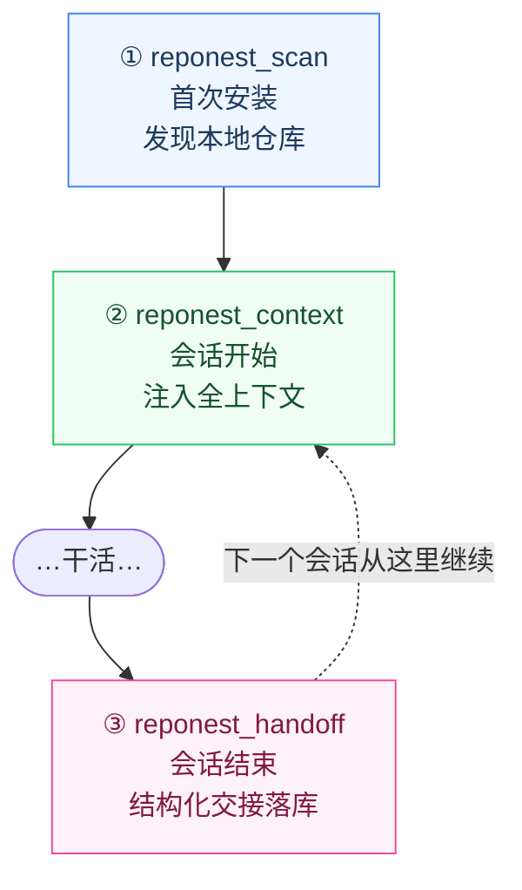
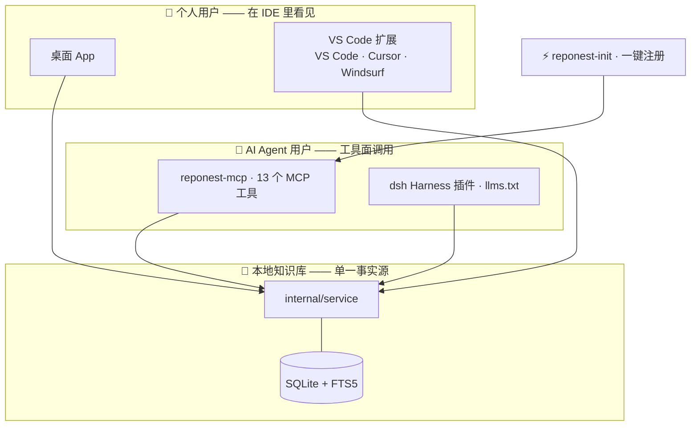

<p align="center">
  
</p>

# RepoNest: Local Git Knowledge Base

本地优先的**跨 agent 项目记忆层**：自动发现本地 Git 项目，把散落在终端和记忆里的项目上下文，变成可检索、可复用、任何 agent 都能读写的记忆。

[English](README.md) | 简体中文

## 目录

- [功能特性](#功能特性)
- [快速开始](#快速开始)
- [VS Code 扩展（预览）](#vs-code-扩展预览)
- [从源码构建](#从源码构建)
- [项目分组规则](#项目分组规则)
- [项目结构](#项目结构)
- [命名分层](#命名分层)
- [文档](#文档)
- [参与贡献](#参与贡献)
- [许可](#许可)



[](https://go.dev)
[](https://react.dev)
[](https://www.typescriptlang.org)
[](./LICENSE)



> 单文件 Wails v2 桌面应用（Go + React，SQLite 内嵌，零 CGO），跨平台 **macOS / Windows / Linux**。
> 离线可用，无云端依赖；AI 通过独立分发的 [`reponest-mcp`](#安装-ai-执行接口reponest-mcp) MCP server 读取同一本地数据库。
> 换 agent 不丢上下文：Claude Code 写下的交接，Cursor 接手时直接读。
> 定位优先级、功能分级与范围冻结规则见 [ADR-0006](docs/adr/0006-scope-freeze.md) 与 [定位简报](docs/positioning-brief.md)。

**Why RepoNest?** 现在的编码 agent 擅长读代码，却不记得**你在这些仓库里积累的判断**：为什么这么设计、上次踩过什么坑、下一个待办是什么。每个 agent 的私有记忆格式互不相通，换工具 = 从零开始。RepoNest 把这些沉淀在一个本地、可检索、任何 agent 都能读写的记忆层里——`reponest_context` 开会话一键注入，`reponest_handoff` 收会话结构化交接，中间的知识按需检索。

## 功能特性

> 分级说明：**核心**（构成「发现→理解→记录→检索→AI」闭环）｜**支持**（服务闭环的可理解性）｜**实验性**（保留但不扩展）｜**暂缓**（不继续投入）。见 [ADR-0006](docs/adr/0006-scope-freeze.md)。

### 知识库（核心）

| 特性 | 说明 |
|------|------|
| Markdown 笔记 | 标题 / 标签 / 分类（知识·日志·想法·其他）/ 置顶 / 跨项目迁移；草稿自动保存 |
| 块编辑器 | 输入 `/` 呼起块面板插入 Callout / Tabs / 折叠块 / 代码 / Mermaid / 公式 / 表格等结构化块，拖拽排序，产物仍是纯 Markdown（**实验性**：暂缓新增复杂块，见 ADR-0006） |
| 富渲染 | highlight.js 代码高亮、Mermaid 图、KaTeX 数学公式、GFM Callout 与任务列表 |
| FTS5 全文搜索 | trigram + bm25 相关性排序、snippet 高亮，覆盖笔记与待办；短 CJK 查询自动降级 LIKE |
| 版本历史 | 每次保存自动快照，查看任意版本与当前的行级 diff，一键恢复 |
| 全局搜索 | ⌘/Ctrl+K 命令面板 + 仪表盘联合搜索（仓库 / 笔记 / 待办） |

### 仓库知识挖掘（核心）

项目详情页自动提取：README 摘要、技术栈清单（20+ manifest 识别）、语言 LOC 占比、依赖清单（npm / go.mod 含块状 require / cargo）、Top 贡献者、活跃度统计、最近提交流；结果缓存于 `repo_meta`，避免重复扫描。

### AI 就绪接口（核心）

| 通道 | 说明 |
|------|------|
| MCP Server | `reponest-mcp` stdio 服务器，13 个工具（仓库扫描 + 上下文注入 + 会话交接 + 笔记 CRUD + 项目查询 + 搜索 + 两个自检），可接入 Claude Code / Cursor 等（AI 执行的唯一接口） |
| `reponest_scan` | 一次性冷启动：播种默认扫描根目录并同步扫描，发现本地 Git 仓库。纯 MCP 安装（不装桌面应用）也能建立知识库 |
| `reponest_context` | 会话开始一键加载项目全上下文：技术栈 / README 摘要 / 依赖 / 最近提交 / 开放待办 / 高相关笔记（交接笔记优先），一次调用替代 3-4 次链式查询 |
| `reponest_handoff` | 会话结束结构化交接：summary / changes / decisions / gotchas / next_steps 渲染为统一模板落库，下一个会话（任何 agent）自动读到 |
| llms.txt | `GenerateLLMsTxt` 生成面向 LLM 的知识库总览 Markdown |
| 笔记导出 | 任意笔记导出为带 YAML frontmatter 的 `.md` |
| Claude 记忆导入 | 一键将 `~/.claude/projects/*/memory/*.md` 幂等导入为知识笔记（**支持**） |
| 数据可信度审计 | `reponest_integrity` 6 项只读检查：FTS 索引漂移、孤儿行、schema 形状 vs 版本戳、扫描覆盖率、知识缓存新鲜度、版本快照孤儿。索引漂移会让搜索**静默漏结果**且无任何机制发现，这是唯一能发现它的手段 |

### 仪表盘与统计（支持）

> 仪表盘与统计服务于核心闭环的可理解性，不作为产品主入口；前端默认页为「知识库」，导航顺序为 知识库 → 仪表盘 → 设置（见 [ADR-0006](docs/adr/0006-scope-freeze.md)）。

| 特性 | 说明 |
|------|------|
| 自动发现仓库 | 配置扫描根目录后递归发现所有 Git 仓库；平台自适应默认规则 |
| 可视化仪表盘 | 每日目标进度环、项目卡片、趋势折线图（7 天 / 30 天 / 全部）、提交热力图 |
| 仓库收藏 | 已收藏仓库展示完整统计卡片；未收藏仓库仅显示名称，按需关注 |
| 按需刷新历史 | 收藏卡片「刷新历史」按需回填该仓库近 365 天的每日统计 |
| 智能项目分组 | 自动识别 Monorepo 与单仓库，手动拆分/合并走单事务（笔记与待办随项目迁移） |
| 工作日检查 | 自定义每日代码量标准，未达标告警 |
| 状态栏 | 最近提交实时展示（仓库 / 分支 / 时间，30 秒缓存） |

### 其他

| 特性 | 说明 |
|------|------|
| 插件系统 | yaegi 进程内 Go 脚本 + 知识源导入器（[知识源导入](docs/plugins/overview.md)；**实验性**，暂停平台基础设施扩展） |
| i18n | 中文 / English 一键切换（react-i18next，zh-CN + en） |
| 单文件跨平台 | Go 编译单二进制，无运行时依赖 |

## 快速开始

### 下载安装

从 [Releases](https://github.com/sky-jiangcheng/repo-nest/releases) 下载对应平台的最新版本。

**方式一：直接下载**

从 Releases 页面下载对应平台的归档文件，解压后运行：

| 平台 | 资产 |
|------|------|
| macOS | `reponest-darwin-arm64.dmg` / `reponest-darwin-amd64.dmg` |
| Linux | `reponest-linux-amd64.tar.gz` |
| Windows | `reponest-windows-amd64.zip` |

**方式二：一键安装脚本**（桌面应用 + `reponest-mcp` 一起装）

| 平台 | 命令 | 装到哪 |
|------|------|--------|
| macOS | `curl -fsSL https://raw.githubusercontent.com/sky-jiangcheng/repo-nest/master/scripts/install.sh \| bash` | `/Applications/RepoNest.app` + `/usr/local/bin/reponest-mcp` |
| Linux | 同上 | `/usr/local/bin/reponest` + `/usr/local/bin/reponest-mcp` |
| Windows | `iwr -useb https://raw.githubusercontent.com/sky-jiangcheng/repo-nest/master/scripts/install.ps1 \| iex` | `%LOCALAPPDATA%\RepoNest`（自动加入用户 PATH） |

macOS 也可以用 Homebrew（需先添加 tap，见 [`packaging/`](packaging/README.md)）：

```bash
brew tap sky-jiangcheng/repo
brew install --cask sky-jiangcheng/repo/reponest
```

启动后直接打开桌面窗口（Wails 应用，无需浏览器）：

1. 首次启动自动播种默认扫描根目录（macOS/Linux 为 HOME，Windows 为非系统盘）
2. 仪表盘点击 **重新扫描** 发现仓库 —— 到这一步**知识库已经可用**，可直接写/搜笔记、交给 AI
3. （可选，只影响仪表盘统计）收藏关注的仓库 → **刷新历史** 回填 365 天统计

> **只想用 AI 能力？** 无需桌面应用：装好 `reponest-mcp` 后让 agent 调一次 `reponest_scan` 即可建立知识库。

更多见[快速开始](docs/getting-started.md)。

### 安装 AI 执行接口（`reponest-mcp`）

AI 客户端走的是独立分发的 `reponest-mcp`（MCP stdio 服务器），**不需要装桌面应用**——它直接读同一个本地数据库。上一节的安装脚本会一并装上；也可以单独安装：

| 方式 | 平台 | 命令 |
|------|------|------|
| 手动（无需任何前置） | 全平台 | 从 [Releases](https://github.com/sky-jiangcheng/repo-nest/releases) 下载 `reponest-mcp-<target>.tar.gz` / `.zip` |
| Homebrew | macOS | `brew tap sky-jiangcheng/repo && brew install --cask sky-jiangcheng/repo/reponest-mcp` |
| Homebrew | Linux | `brew tap sky-jiangcheng/repo && brew install sky-jiangcheng/repo/reponest-mcp` |
| Scoop | Windows | `scoop bucket add repo https://github.com/sky-jiangcheng/scoop-repo && scoop install repo/reponest-mcp` |

装好后注册到 AI 客户端——一条命令覆盖 Claude Code / Cursor / VS Code / Windsurf（[ADR-0009](docs/adr/0009-ide-presence.md) 第一步，幂等可重复执行）：

```bash
node scripts/reponest-init/index.mjs --with-hook
```

或只注册 Claude Code：

```bash
claude mcp add reponest -- "$(which reponest-mcp)"
```

#### 30 秒看它干活

注册后，首次使用只差一步：

> **首次使用**（建立知识库，无需桌面应用）：
> Agent 调用 `reponest_scan()` — 播种默认扫描根目录并扫描，一次拿到本地仓库清单。

之后每个工作会话都是这个节奏：

> **会话开始**（新 agent 接手项目）：
> “继续 auth 项目的工作。”
>
> Agent 调用 `reponest_context({ project_name: "auth" })` — 一次拿到技术栈、待办、上次会话的交接笔记，直接开工。

> **会话结束**（知识不蒸发）：
> Agent 调用 `reponest_handoff({ project_id: 1, summary: "完成 OAuth 迁移", gotchas: ["生产环境的 cookie key 需要轮换"], next_steps: ["跑一遍回归"] })` — 下次会话（哪怕换 Cursor）自动从这里继续。

日常还可以随时问：

> “我本地有哪些项目？关于 auth 我之前记了什么？”

Agent 会调用 `reponest_projects_list` → `reponest_notes_search` → `reponest_notes_read`；新结论用 `reponest_notes_create` 写回。也可以从任意笔记导出带 YAML frontmatter 的 `.md`，或生成面向 LLM 的 `llms.txt` 总览。完整工具清单与工作流见 [SKILL.md](SKILL.md)。

清单在 [`packaging/`](packaging/README.md)，版本号统一由 `wails.json` 派生，`sha256` 取自 release 实际提供的资产（Homebrew / Scoop 校验不通过会直接拒绝安装，这是预期行为）。已发布版本：

- **Homebrew**：[sky-jiangcheng/homebrew-repo](https://github.com/sky-jiangcheng/homebrew-repo)
- **Scoop**：[sky-jiangcheng/scoop-repo](https://github.com/sky-jiangcheng/scoop-repo)

> 桌面应用同理：`brew install --cask sky-jiangcheng/repo/reponest`（macOS）、`scoop install repo/reponest`（Windows）。Linux 桌面版只提供 tarball。

### 数据目录

配置与数据库存储在用户应用数据目录（升级自动迁移 schema）：

- **macOS**: `~/Library/Application Support/reponest/dashboard.db`
- **Windows**: `%APPDATA%/reponest/dashboard.db`
- **Linux**: `~/.config/reponest/dashboard.db`

日志路径见[故障排查](docs/troubleshooting.md)。

## VS Code 扩展（预览）

扩展（VS Code / Cursor / Windsurf —— 一个 VSIX 三端通用）目前为**预览版**。每个产品版本发布时会自动同步上架 [Marketplace](https://marketplace.visualstudio.com/items?itemName=sky-jiangcheng.reponest-vscode)（配置 `VSCE_PAT` secret 后生效）；`.vsix` 同时挂在每个 [Release](https://github.com/sky-jiangcheng/repo-nest/releases) 下可手动安装，也可以从源码打包：

```bash
git clone https://github.com/sky-jiangcheng/repo-nest.git
cd repo-nest/ide/vscode
npm install
npx @vscode/vsce package --no-dependencies   # → reponest-vscode-0.1.0.vsix
```

安装生成的 `.vsix`：

- **界面**：扩展视图 → `⋯` 菜单 → **从 VSIX 安装…**
- **命令行**：`code --install-extension reponest-vscode-0.1.0.vsix`（Cursor / Windsurf 把 `code` 换成 `cursor` / `windsurf`）

扩展是瘦客户端：命令经 stdio 调用 `reponest-mcp`（请先安装——brew / scoop / [Releases](https://github.com/sky-jiangcheng/repo-nest/releases)），所有答案都来自与桌面应用相同的 `internal/service` 层。能力清单见 [`ide/vscode/README.md`](ide/vscode/README.md)。

## 从源码构建

环境要求：**Go 1.25+**、**Node.js 20+**（前端构建）、可选 [Wails CLI](https://wails.io) v2.13+。

```bash
# 前端依赖与构建（web/dist 会被 go:embed 进二进制）
cd web && npm install && npm run build && cd ..

# 桌面应用
go build -ldflags "-s -w" -o reponest .

# MCP server
go build -o reponest-mcp ./cmd/mcp/

# 或使用脚本
./scripts/build.sh
```

开发模式：`wails dev`（前端热更新 + Wails 绑定注入）。

测试与检查：

```bash
go test ./...            # Go 全量测试（service/db/knowledge/scanner/diff…）
cd web && npm test       # vitest
cd web && npm run build  # tsc 严格检查 + 生产构建
```

## 项目分组规则

| 场景 | 分组规则 |
|------|---------|
| 单仓库项目 | 父目录包含唯一仓库 → 父目录即为项目 |
| MonoRepo | 父目录包含多个子仓库 → 归为一个项目 |
| 嵌套仓库 | 父目录本身是 Git 仓库且子目录也有仓库 → 拆分为独立项目 |

在项目详情页可手动 **向上合并** / **向下拆分** 调整分组级别（单事务，笔记与待办随迁）。

## 项目结构

```
main.go                  # Wails 入口：DB 初始化、扫描根播种、窗口与安全头
internal/
  app/                   # Wails 绑定层：每方法 1-3 行委托 service
  service/               # 业务核心：扫描管线、统计刷新、项目/笔记/搜索/导出
                          # （Wails 桌面、CLI、MCP 三端共享同一实现）
  domain/                # 跨层共享的行类型
  db/                    # SQLite：schema/迁移 + 按域拆分的查询（projects/notes/…）
  core/git/              # Git Provider 抽象（本地 CLI 实现）
  core/plugin/           # 插件 SPI + yaegi 运行时
  stats/ knowledge/      # git log 统计、仓库知识挖掘
  scanner/ grouper/      # 文件系统扫描、项目分组
  platform/              # OS 差异：数据目录、日志路径、扫描根默认值
  version/ diff/         # 单一版本号源、笔记行级 diff
cmd/
  mcp/                   # MCP stdio 服务器（AI 执行接口 + agent-score 自检工具）
web/src/
  api/                   # types + transport（Wails/HTTP 双模）+ endpoints
  hooks/                 # useApiData（缓存）/ useDebouncedCallback / useScanPolling…
  pages/ components/     # 页面与组件（大页面已按域拆分子目录）
  locales/ styles/       # zh-CN + en；设计系统 CSS
```

架构决策见 [ADR](docs/adr/index.md)（尤其 [ADR-0005 服务层重构](docs/adr/0005-service-layer.md)）；分层与数据流详见[架构说明](docs/architecture.md)。前后端接口契约（Wails 绑定面）见 [API 参考](docs/api/reference.md)。

## 命名分层

品牌名与机器标识**有意不一致**：展示层负责被记住，标识层负责稳定（URL、升级链、数据迁移、对外契约都不随品牌措辞变化）。

| 层 | 取值 | 落点 |
|------|------|------|
| 品牌名（展示层） | `RepoNest` | `productName`、应用内 Logo、文档与 UI 文案 |
| 完整展示名 | `RepoNest: Local Git Knowledge Base` | 窗口标题、HTML `<title>`、README 标题 |
| 仓库与包标识 | `repo-nest` | GitHub 仓库名、Go module 名、npm 包名、文档站 URL |
| 冻结标识（永不随品牌变） | `reponest` | 命令名 / 二进制名（`outputfilename`）、用户数据目录、MCP server 名 `reponest-mcp` 与工具前缀 `reponest_*` |

冻结标识的历史原因：数据目录 `reponest` 已经历 gitboard → gitbuddy → reponest 两轮自动迁移，再次改名意味着第三次数据搬家；MCP 工具名是对 AI 客户端的对外契约，改名会使已有配置与允许列表失效。贡献时请勿「顺手统一」这些名字。

## 文档

| 文档 | 内容 |
|------|------|
| [快速开始](docs/getting-started.md) | 安装、首次配置、扫描 |
| [数据与备份](docs/data-management.md) | 备份、迁移机器、重置与卸载 |
| [功能手册](docs/features/knowledge.md) | 仪表盘 / 知识库 / 项目详情 / 设置 / 命令面板 |
| [知识源导入](docs/plugins/overview.md) | 插件 SPI、事件、知识源导入器 |
| [AI 集成](docs/features/ai-integration.md) | CLI、MCP、llms.txt |
| [API 参考](docs/api/reference.md) | Wails 绑定面契约 + OpenAPI |
| [架构说明](docs/architecture.md) | 分层、数据流、关键决策 |
| [故障排查](docs/troubleshooting.md) | FAQ 与日志路径 |
| [SKILL.md](SKILL.md) | 面向 AI 代理的能力卡片 |
| [TODO.md](TODO.md) | 已知事项与待办 |

[在线文档](https://sky-jiangcheng.github.io/repo-nest/zh/)（GitHub Pages，随 master 自动部署；默认语言为英文，中文手册在 `/zh/` 路径）。

## 参与贡献

开发环境与提交规范详见 [CONTRIBUTING.md](CONTRIBUTING.md)。快速上手：

开发环境：**Go 1.25+**、**Node.js 20+**、Git。

```bash
cd web && npm install && npm run build && cd ..  # 前端构建
go test ./...                                      # Go 测试
cd web && npm test                                 # 前端测试
wails dev                                          # 开发模式（可选）
```

架构约定见 [docs/architecture.md](docs/architecture.md) 与 [docs/adr/](docs/adr/index.md)。提交规范采用 [Conventional Commits](https://www.conventionalcommits.org/)。安全问题请走[私密报告渠道](SECURITY.md)。

## 许可

[MIT](LICENSE)
