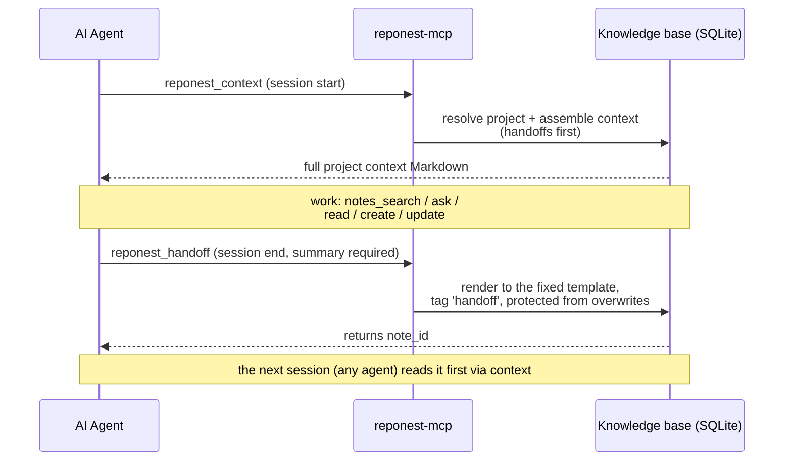

# AI Integration

RepoNest provides read channels and self-check tools for AI agents, all reusing the same `internal/service` implementation (behavior identical to the desktop app).

## Value proposition: RepoNest is a data source for AI, not an AI platform

**RepoNest does not host models, does not hold API keys on your behalf, and ships no agent orchestration.** More precisely: it is the **data foundation** — it models raw git information into a structured, indexable, materializable local knowledge base (see [Storage Optimization and AI Value](../storage-optimization.md)); AI tools (Claude Code / Cursor, etc.) **consume** this layer of data through the 13 MCP tools, fetching on demand and searching precisely.

For the argument for why this layer is better than letting AI read git directly, see [Storage Optimization and AI Value](../storage-optimization.md).

A boundary that needs stating: earlier versions of this page claimed "**RepoNest does not call any large language model**". **The product has since disproved that sentence** — AI Q&A (v1.15.0) calls an OpenAI-compatible `/chat/completions`, and optional semantic search calls `/v1/embeddings`. The accurate positioning is the sentence above: models and endpoints are **user-supplied**, the capabilities are **off by default**, and keys stay local. The distinction is worth being pedantic about because it decides where privacy responsibility lies — "we don't ship AI" means not one line of your notes leaves this machine unless you explicitly enabled it and typed in your own endpoint; "we ship AI" would not be that promise.

### Configuration keys

The whitelist in `internal/service/config.go` splits into two groups. **Core configuration has nothing to do with models or APIs**:

| Key | Type | Default | Purpose |
|-----|------|---------|---------|
| `auto_import` | 0 / 1 | `1` | Whether startup auto-imports knowledge sources (today only `claude` is an automatic source; the other four are manual) |
| `daily_code_standard` | integer | `500` | The daily code target (lines per day), used for the dashboard goal display. The name says "code standard" but it is not an AI standard — easy to misread |
| `scan_depth` | integer | `2` | Scan directory depth |
| `git_author` | string | System git user | Affects "My" statistics / heatmap attribution |

**The AI-side keys are all optional, all off by default, and all require you to supply the endpoint** — RepoNest brings no service of its own:

| Key | Default | Purpose | What leaves the machine if enabled |
|-----|---------|---------|-----------------------------------|
| `claude_session_capture` | off | Allow reading Claude session transcripts on demand for handoff ([ADR-0010](../adr/0010-session-auto-capture.md)) | Nothing externally, but transcripts are read from disk |
| `openclaw_project` / `hermes_project` | empty | Target project for the two agent-global memory sources; unset means the whole source skips | Nothing |
| `semantic_search` + `embedding_base_url` / `embedding_model` / `embedding_api_key` / `embedding_dim` | off / empty | Vector recall covering FTS5's blind spots ([ADR-0012](../adr/0012-semantic-search.md)) | **Note text** → your embedding endpoint |
| `vector_store` + `vector_store_url` / `vector_store_api_key` / `vector_store_collection` | `local` | Where vectors live: local sqlite-vec, or remote Qdrant / Weaviate ([ADR-0013](../adr/0013-vector-database-selection.md)) | Vectors (not raw text) → your remote store |
| `ai_chat_base_url` / `ai_chat_model` / `ai_chat_api_key` | empty | AI Q&A on the project detail page | Your question + the packaged project context → your chat endpoint |

The three key-holding settings (`embedding_api_key`, `vector_store_api_key`, `ai_chat_api_key`) come back masked when configuration is read and are never sent to the UI — the backend holds the real value, the interface shows `********`.

## Semantic search and vector storage (optional)

Lexical search cannot answer "the same fact phrased differently"; vector recall covers that blind spot. The whole chain is off by default and **every failure degrades back to pure lexical results** — turning it on cannot return fewer hits ([ADR-0012](../adr/0012-semantic-search.md)).

- **Guided setup**: `go run ./cmd/vector-init`. It self-checks that sqlite-vec is loaded (create vec0 → write a test vector → KNN round trip → clean up), lets you pick an embedding provider (local Ollama is the default recommendation, or any OpenAI-compatible remote), writes the configuration, and finally points you at the in-app settings to review. Adding `-store qdrant` (or `weaviate`) writes a remote vector store and probes it immediately; **unreachable or unconfigured falls back to local automatically**, so search never gets worse.
- **The first run needs one full rebuild** (one text upload per note). After that, no more rebuilds: note creation, title/body edits and deletions are queued by database triggers and drained in the background every 5 seconds; vectors of deleted notes are removed from the index. When the dimension is unknown or the index does not exist yet, the drainer skips without consuming the queue (guessing a dimension risks dropping the whole index), and when the endpoint is unreachable the queue is kept and retried on the next tick. Details in [Knowledge Base and Notes](knowledge.md).
- **Measure before shipping the switch**: `go run ./cmd/abeval` runs "lexical vs lexical+vector" against a live database, reporting Recall@k / NDCG@k with a threshold gate. Until a real labelled query set passes that gate, the settings page deliberately offers no switch — an unproven feature is worse than a missing one.

## AI Q&A: what it actually is today

The floating-ball panel on the project detail page has an AI Q&A tab (since v1.15.1 it moved out of the page header into the panel, sharing the shell and the project selector with the logging tab). Describing the current implementation honestly, rather than letting you read it as RAG:

- The context is **statically packaged**: the project's repositories (up to 15) + the first repository's mined cache (tech stack / languages / README excerpt) + **the 10 most recent notes, each truncated to 500 bytes**, assembled into the system prompt.
- One POST to an OpenAI-compatible `/chat/completions` (LM Studio, an Ollama shim, or a cloud provider), **non-streaming, no tool calls, no retrieval ranking, no citations**.
- In other words it *stuffs context* rather than *gathering evidence*: it does not guarantee relevant notes are read, nor that what was read reaches the answer. Turning it into real evidence-gathering (read the index → rank pages with FTS + vectors → answer with citations → file good answers back as new pages, plus an item / character / timeout budget and streaming) is M6-W2 in [ADR-0014](../adr/0014-llm-wiki-knowledge-compiler.md), gated on the `abeval` threshold above.
- If nothing must leave the machine, use **Copy AI context** on the detail page: it puts the packaged prompt on the clipboard and you decide where it goes; no endpoint is called.

## Headless HTTP service and the executable inventory

Beyond MCP there is a second channel onto the same implementation: expose `internal/service` over loopback HTTP for browser mode, scripts and other agents.

```
go build -o reponest-server ./cmd/server
./reponest-server --port 18765        # or env REPONEST_HTTP_PORT; listens on 127.0.0.1 only
```

- `POST /api/rpc` reflects every desktop binding (JSON body naming method + args) and runs the **same implementation** as Wails; `Startup` / `Shutdown` / `Service` itself are excluded. Write operations obey the same protocol protections as MCP (for example handoff notes refuse to be overwritten by update).
- For browser development use `bash scripts/dev.sh`: it starts the headless API (default 18731) *and* Vite. Running `npx vite` alone yields a page that loads but 502s every request — that is a missing backend, not a broken app.
- **Release assets contain only**: the desktop installers (4 platforms), `reponest-mcp-<platform>`, and the VS Code VSIX. `reponest-server`, `cmd/vector-init`, `cmd/abeval` and `cmd/reponest-capture` must be built yourself (`go build` / `go run`); they are not distributed with releases.

MCP is the only AI execution interface (the `reponest` CLI is not shipped with releases). stdio protocol, the database is opened once per process, 13 tools (including 4 write operations: scan + note create/update + session handoff):

The two ends of the session memory protocol, in sequence:



How to read it: the protocol has exactly **two entry calls** (`reponest_context` to open a session, `reponest_handoff` to close it) and one guarantee in between — a handoff note is written once, tagged `handoff`, and `reponest_notes_update` refuses to overwrite it, so the next session always reads the same record at the top of its context.

| Tool | Description | Read/Write |
|------|-------------|------------|
| `reponest_scan` | Cold start: seeds the default scan roots and scans them synchronously, discovering local Git repositories (works with a pure MCP install, no desktop app needed) | Write |
| `reponest_context` | Injects the full project context at session start (tech stack / README / todos / highly relevant notes, with handoff notes pinned to the top) | Read |
| `reponest_handoff` | Structured handoff at session end (summary/changes/decisions/gotchas/next_steps), persisted to the database and read back pinned-to-top by the next `reponest_context`; notes written this way carry a `handoff` tag, and `reponest_notes_update` refuses to overwrite them | Write |
| `reponest_notes_list` | All notes | Read |
| `reponest_notes_search` | FTS5 search (query) | Read |
| `reponest_notes_read` | Read a note by ID | Read |
| `reponest_notes_create` | Create a new knowledge note | Write |
| `reponest_notes_update` | Update note content and metadata (partial update; refuses to overwrite `handoff` protocol notes) | Write |
| `reponest_projects_list` | All projects | Read |
| `reponest_projects_stats` | Project statistics (by id) | Read |
| `reponest_ask` | Q&A-style retrieval, top-5 text results | Read |
| `reponest_agent_score` | Check local AI readiness (DB / notes / search / MCP / llms.txt / SKILL.md / i18n) | Read |
| `reponest_integrity` | Audit data trustworthiness (FTS index drift / orphan rows / cache freshness / coverage) | Read |

### Readiness vs. data trustworthiness

The two self-check tools answer **different questions** — don't mix them up:

| Tool | Question it answers | Question it cannot answer |
|------|--------------------|---------------------------|
| `reponest_agent_score` | Is this installation configured correctly? (notes present? MCP reachable? i18n complete?) | Whether the data itself is correct |
| `reponest_integrity` | Can the data still be trusted? (has the index drifted? are there orphan rows? is the cache fresh?) | Whether the configuration is complete |

**Why the second one exists**: once the FTS5 index drifts out of sync with `project_notes`, search **silently returns fewer results**, while `agent_score` still reports "Search operational" — it measures connectivity, not content. `reponest_integrity` compares the index's real document count against the FTS5 `_docsize` shadow table (with an external-content table, a plain `SELECT rowid` reads the content table, so it would never reveal the drift) and checks that the sync triggers are all in place. For details, see the [checklist in `internal/integrity`](../../../internal/integrity/integrity.go).

When an AI notices that "the search results seem incomplete", it should run `reponest_integrity` first instead of jumping to the conclusion that the knowledge base has little content.

### One-command registration (reponest-init, recommended)

Step one of [ADR-0009](../adr/0009-ide-presence.md): detect the binary and register every supported client with a single command; idempotent and safe to re-run:

```bash
node scripts/reponest-init/index.mjs --with-hook
```

- Detects `reponest-mcp` (override with `--bin`) and registers it with Claude Code (`.mcp.json`), Cursor (`.cursor/mcp.json`), VS Code (`.vscode/mcp.json`) and Windsurf (configs land only where the client's directory exists); JetBrains gets printed manual guidance
- `--with-hook` also installs the SessionEnd hook below (script + merged `settings.json`, backed up before changes)
- `--dry-run` previews every write; when the binary is missing it prints install guidance, and `--yes` writes the bare command name `reponest-mcp` (works once installed)

### Connect Claude Code manually (alternative)

```bash
claude mcp add reponest -- /path/to/reponest-mcp
```

Or write it into `.mcp.json` (project level) / `~/.claude.json` (user level):

```json
{
  "mcpServers": {
    "reponest": { "command": "/usr/local/bin/reponest-mcp", "args": [] }
  }
}
```

### Automatic handoff at session end (SessionEnd hook)

The real meaning of "zero-cost capture" is not "the agent remembers to call it on its own" — relying on goodwill is the same as making no promise. Claude Code's **SessionEnd hook** turns the handoff into part of the session lifecycle: the moment a session ends, the handoff happens, no matter how good the agent's memory is. This is also the path that lets a new user feel "the next session starts with full context" on day one.

Write it into `.claude/settings.json` (project level, shared with collaborators through the repository):

```json
{
  "hooks": {
    "SessionEnd": [
      {
        "hooks": [
          {
            "type": "command",
            "command": "\"$CLAUDE_PROJECT_DIR\"/.claude/hooks/reponest-handoff.sh"
          }
        ]
      }
    ]
  }
}
```

The companion script `.claude/hooks/reponest-handoff.sh` (remember to `chmod +x`):

```sh
#!/bin/sh
# SessionEnd hook: make the handoff automatic instead of relying on the
# agent's goodwill. One bounded headless turn costs a fraction of the
# session it preserves; "the agent will remember to call handoff" costs
# the entire exit record whenever it forgets.
set -u
cd "${CLAUDE_PROJECT_DIR:-$(pwd)}" || exit 0
command -v claude >/dev/null 2>&1 || exit 0
claude -p --mcp-config .mcp.json \
  'This session ended. Call reponest_handoff for the current project: a concise summary plus next_steps. If the project cannot be resolved, call reponest_context once first. Do nothing else.' \
  >/dev/null 2>&1 || true
```

Design points and costs (stated plainly, so the narrative doesn't oversell):

- **Trigger**: fired by Claude Code when a session ends; the trigger reason (`clear` / `logout` / `prompt_input_exit` / `other`) is written to stdin as JSON, and the script can read stdin and skip when appropriate (e.g. "the context was just cleared" doesn't need a handoff).
- **Cost**: one bounded headless turn (`claude -p`), a fraction of the whole session context it preserves; the hook has a default timeout (60s) and the script ends silently with `|| true`, so the session exit is never blocked.
- **Fallback path**: skipped outright when the `claude` CLI is missing; when MCP is not registered, the headless call fails and is swallowed — the protocol requires handoffs to be written through `reponest_handoff`; the hook only guarantees "it always fires" and never bypasses the protocol to write the database directly.
- **Protocol protection**: handoff notes carry the `handoff` tag and `reponest_notes_update` refuses to overwrite them (guarding against accidental clobbering); in the next session, `reponest_context` renders them in full, pinned to the top.
- The hook's event name and configuration fields evolve with Claude Code versions; before wiring it up, defer to `claude --help` and the official hooks documentation.

### Connect Cursor / other MCP clients

Add the same `command` pointing at the `reponest-mcp` binary in the client's MCP configuration (Cursor: `Settings → MCP → Add Server`).

## llms.txt and Markdown export (in-app)

- **llms.txt**: `GenerateLLMsTxt` generates a knowledge base overview in Markdown (project directory + tech stack + the 20 most recent knowledge notes), suitable for feeding an LLM to establish context. **llms.txt is an export format** (generated in-app, not shipped with the repository) and is not being expanded into a standalone product direction (see ADR-0006)
- **Note export**: any note can be exported as `.md` with YAML frontmatter (`ExportNoteAsMarkdown`)
- **Claude memory import**: idempotent import from `~/.claude/projects/*/memory/*.md` (see [Knowledge Base](knowledge.md))

## agent-score self-check

agent-score has been merged into the MCP tool `reponest_agent_score`; no separate build is needed. Call it from any MCP client to get the 7-item AI readiness score.

## Why not just let AI read the git repository

A common question: since Claude Code / Cursor can run `git log` and read files directly, why route through RepoNest at all? The core answer is **cost and determinism**:

- **Reading is expensive**: every direct `git log` or file-by-file scan is a one-off expense — repeated reads mean repeated tokens;
- **Reading is messy / incomplete**: large repositories inevitably exceed the context window and get truncated, and the model may hallucinate or skip binary files / `.gitignore`;
- **Reading is slow**: recomputing statistics on every call turns a seconds-scale task into a minutes-scale one.

RepoNest parses and materializes the raw git data into local SQLite **once at scan time** (`daily_stats` pre-aggregates statistics, `repo_meta` caches mined results, `project_notes_fts` builds the full-text index); after that, AI only fetches on demand and hits precisely through the MCP tools. For the full comparison and storage structure details, see [Storage Optimization and AI Value](../storage-optimization.md).

## Skill card for AI agents

[SKILL.md](https://github.com/sky-jiangcheng/repo-nest/blob/master/SKILL.md) at the repository root is a capability card written for agents to read (commands, tool table, paths) — feed it to them directly.
