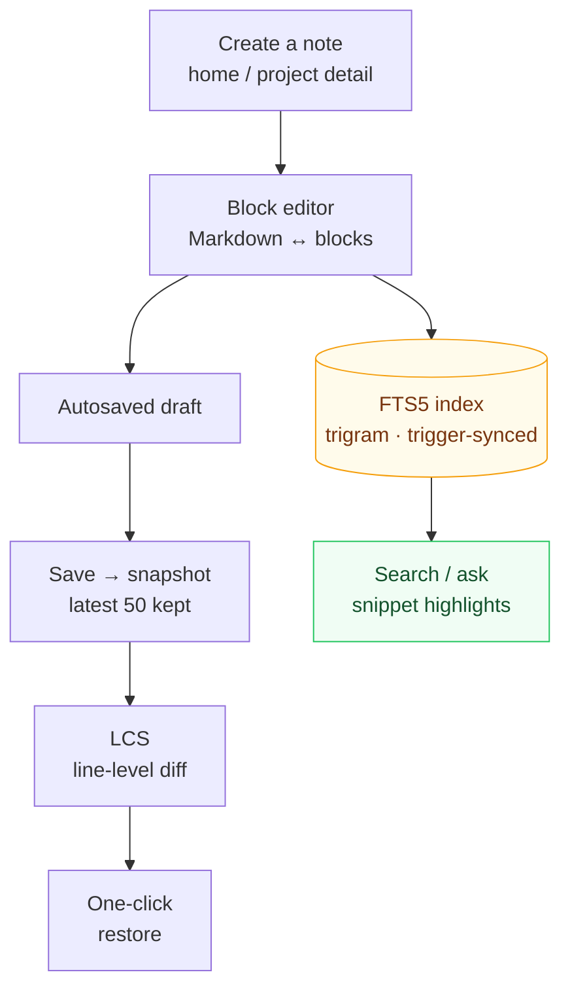

# Knowledge Base and Notes

The knowledge base is the app's home page and the hub for cross-project notes: Markdown / block editor, tag categories, FTS5 full-text search, version history, and AI memory import.



How to read it: one **trunk (edit → save → snapshot → diff → restore)** plus one **branch (index → search)**. The trunk solves "knowledge must not be lost"; the branch solves "knowledge must be findable" — both are triggered by the same save action (snapshots via a write trigger, the index via the FTS sync trigger), so there is no save button to remember. The **History** button on a note card enters the version side; the search box enters the branch.

## Managing notes

- **Create a note**: pick a project in "Quick create note" on the home page, or create one from the notes panel on the project detail page
- **Metadata**: title (falls back to the first line if left empty), tags (comma-separated), category (knowledge / log / idea / other), pinned
- **Move across projects**: use the "Linked project" dropdown while editing to migrate in one click
- **Autosaved drafts**: edits are saved locally in real time, so nothing is lost if the app closes unexpectedly

## Block editor

Type `/` to open the block panel and insert structured blocks:

| Block | Description |
|----|------|
| Callout | TIP / WARNING / NOTE callouts |
| Code block | with language highlighting |
| Mermaid diagram | flowcharts / sequence diagrams, etc. |
| Math formula | rendered with KaTeX |
| Todo list / table / divider | common structures |
| Collapsible block / Tabs | `<details>` and `` |

- Blocks can be drag-sorted, moved up or down, and deleted individually
- **Switch between Markdown and blocks at any time**: the storage format is always plain Markdown, so any editor can open it

## Rich rendering

highlight.js code highlighting, Mermaid diagrams, KaTeX math formulas, GFM callouts, and task lists.

## Search

- The home page search box is auto-focused; "Ask the knowledge base" mode returns answer snippets ranked by relevance
- FTS5 trigram + bm25 ranking, with snippets highlighting matched terms; short CJK queries automatically fall back to LIKE
- Covers notes and todos; the `⌘/Ctrl+K` command palette works from anywhere

### Semantic search (optional, off by default)

Lexical search answers "which characters matched", not "the same fact phrased differently". Optional vector recall covers exactly that blind spot:

- **Two-stage fusion**: FTS5 and vector recall are merged with RRF (k=60); vectors only ever **add** — if any step fails (endpoint unset, request error, index missing) it falls back to the pure lexical result, so **turning it on cannot return fewer hits**. That is a design constraint, not a reassurance.
- **Off by default**: active only when `semantic_search=1` **and** an embedding endpoint is configured (`embedding_base_url` + `embedding_model`). The settings page does not expose these yet; enable them via the configuration keys described in [AI Integration](ai-integration.md).
- **The first time needs one full rebuild**: every note's text is embedded, which is an O(all notes) walk of the endpoint. It also persists the vector dimension it discovers.
- **No further rebuilds afterwards**: note creation, title/body edits and deletions are queued by SQLite triggers and drained in the background every 5 seconds — live notes get re-embedded, deleted notes are removed from the vector index (otherwise text you deleted keeps showing up in recall). Three deliberate conservations: pinning, retagging and moving a note do **not** trigger an embed (they do not change the text sent to the endpoint); when the endpoint is unavailable the work stays queued and retries, so an offline laptop loses nothing; and when the dimension is unknown or the index does not exist yet it skips rather than guessing.
- **Imported notes are indexed the same way**: queueing happens in database triggers, and every writer (UI, MCP, CLI, agent-memory importers) converges on that layer — which is precisely why this was not built into application logic.
- **Privacy boundary**: enabling semantic search means note text is sent to the embedding endpoint you configured (local Ollama or a remote API, depending on `embedding_base_url`). That is an explicit choice, off by default; `embedding_api_key` and `vector_store_api_key` are secrets, returned masked when configuration is read and never handed to the UI.
- **The vector index is a derived cache**; the notes themselves are the source of truth: it can be dropped and recomputed at any time, living in the same database file as the notes, in the same transactions and the same backups (pure-Go sqlite-vec, zero CGO). A remote vector store is only worth reaching for at real scale — see [AI Integration](ai-integration.md).
- **Whether it helps is measurable before it ships**: `cmd/abeval` runs "lexical vs lexical+vector" against a live database and reports Recall@k / NDCG@k with a threshold gate. The gate comes before the switch deliberately — until there is a real labelled query set, no UI toggle ships.

## Version history

A snapshot is created automatically on every save (the latest 50 are kept). The **History** button on the note card opens:

- A version list (time, title)
- A line-level LCS diff of any version vs the current one (+/- markers)
- One-click restore to any historical version

## Import knowledge from agent memory

Six built-in sources idempotently import the memory and session transcripts you already left in other agent tools as knowledge notes (re-importing updates existing notes instead of duplicating them):

| Source | Trigger | Reads |
|--------|---------|-------|
| `claude` | automatic at startup | `~/.claude/projects/*/memory/*.md` |
| `codex` | manual | session transcripts `rollout-*.jsonl` (first instruction + last reply) |
| `opencode` | manual | session titles and summaries |
| `openclaw` | manual | `~/.openclaw-autoclaw/workspace/*.md` |
| `hermes` | manual | `~/.hermes/memories/{MEMORY,USER}.md` |
| `cursor` | manual | Cursor sessions inside `globalStorage/state.vscdb` (best effort, see below) |

**Settings → Plugins** lists every source, lets you trigger each one manually, and shows the per-source `{created, updated, skipped}` counters.

Three rules that are easy to trip over:

1. **Imports land on a project, they do not pile onto the knowledge home page.** Documents are matched to a specific project by project name / repository path; whatever does not match is counted as `skipped` and not stored. So scan the projects first — hit rate depends on that order.
2. **`openclaw` and `hermes` need their target project configured first** (`openclaw_project` / `hermes_project`); otherwise the entire source is silently skipped.
3. **A repeat import is not a failure.** `created=0` plus `updated=N` means idempotency worked and the content was refreshed.

**`cursor` is the only best-effort source**: Cursor's on-disk format is undocumented and versioned, so it takes only the **first prompt and last reply** of each session (never a full transcript), resolves ownership through `workspaceStorage/<id>/workspace.json` and skips what it cannot match rather than guessing — and when the database shape is not one it recognizes, **the whole source fails loudly instead of quietly importing zero notes** (because "nothing imported" must stay distinguishable from "you have no sessions"). Every read opens that file `mode=ro`; another application's data is never written.

Imported notes carry `kind` = `knowledge` (memory files) or `log` (session records) and are findable by full-text search as soon as they are written; with semantic search enabled they are also picked up by vector recall without another rebuild (see above). Full paths, matching rules and limitations per source are in [Knowledge source plugins](../plugins/overview.md).

## Knowledge pages and the review queue

Notes are the **raw record**; pages are the **compiled artifact**. The same fact can live in a note (who did what, when, how) and still grow concept and entity pages linked to each other in a graph — the shape `project_notes` cannot express on its own, since a note hangs off a project and references nothing else.

| Page kind | Holds |
|-----------|-------|
| `entity` | A concrete thing (module, service, repository, person) |
| `concept` | An idea (idempotency key, session timeout, scan-depth semantics) |
| `source` | A summary page for one source document |
| `synthesis` | Cross-source synthesis and conclusions |
| `query` | A filed answer from Q&A (see "File as page" in [AI Integration](ai-integration.md)) |

The page layer is a **derived cache**: notes remain the source of truth, the whole layer can be dropped and rebuilt (`DropWikiSchema`), and if it is dropped it grows back on the next open.

### Edges between pages: a controlled relation vocabulary (schema v21)

Pages are wired into a graph by **directed links**, and every link carries a **relation type**. Early on that type was free text (the compiler wrote `compiled-from`, a filed answer wrote `cites`, and the model wrote whatever it liked), so "what are all the dependency links in this graph" was unanswerable. v21 ([ADR-0018](../adr/0018-knowledge-graph-foundation.md), first half) freezes it into eight enumerated values, enforced by a database `CHECK`:

| Relation | Meaning |
|----------|---------|
| `ref` | generic reference (the default; reach for it when unsure) |
| `part-of` | composition: A is part of B |
| `depends` | dependency: A depends on B |
| `implements` | A implements a concept/interface B |
| `documents` | A describes B |
| `supersedes` | A replaces an older B |
| `contradicts` | A and B conflict |
| `mentions` | A's body links to B |

Edges grow from three places: the **compiler** creates `pending` edges using the vocabulary above; **answer filing** points a query page at the evidence pages it used (`ref`); and when you **approve a page**, the system resolves the `[[wikilinks]]` in its body into `mentions` edges — linking only to pages that actually exist, so a link to a missing page stays a "dangling link" for lint rather than fabricating a node. None of the three needs a model, so they can run automatically while keeping the human in the loop: the approve action itself is the signal that "these links are trustworthy".

> When migrating to v21, the assorted historical relation values in an old store are **normalized** into these eight (for example, legacy `compiled-from` and `cites` fold into `ref`, `depends-on` into `depends`). This relabels only; it never drops an edge, and parallel edges between the same pair that collapse to one value are merged.

lint also runs three **structural checks** along relation type (all pure SQL/in-memory, no model, no cost): whether a `supersedes` edge is inverted (the superseder is older than what it supersedes), whether `part-of`/`depends` form a cycle, and whether a `contradicts` is one-sided (a contradiction should be symmetric). Like every other check, they **only write project todos for a human to read — lint never auto-edits a page or deletes an edge**.

### Pending and approved (the one most often mistaken for a bug)

Pages have a status, and status decides whether a page may answer anything:

- `approved`: searchable, listed in the export index, usable as Q&A evidence.
- `pending`: **visible but not searchable**. Lists, the export bypass, the review queue and lint all see it; retrieval and Q&A deliberately do not.

So "I generated a page but search cannot find it" is not a defect: anything a model wrote is pending until a human approves it. Pages created manually in the app, and answers you file via File as page, are `approved` at birth — those are human actions. Only compiler output lands as `pending`. Rejecting a pending page deletes that row and cascades its links and source attachments; rejecting is explicitly refused for approved pages.

### Who writes pages

1. **Humans**: filing an answer as a `query` page, and future manual page creation.
2. **The compiler** (once `wiki_compile` is on): it reads one note and proposes which pages to create, which links to add, which sources to declare — all landing as `pending`. It **can only create; it can never edit an approved page** — a revision request becomes a todo for a human instead. Every page it produces is automatically attached to the note it read.
3. **Lint** (read-only): it inspects graph health and never edits a page.

### Memory layers (L3 → L0)

"What this project is" and "a raw session transcript" should not carry equal weight in one context. `LayeredProjectContext` assembles memory by stability, and Q&A uses the same two top layers:

| Layer | Contents | When fetched |
|-------|----------|--------------|
| L3 global profile | **Approved** pages owned by no project (cross-project conventions, preferences) | always, first |
| L2 project scenario | repository list + mined tech stack: what the project is | always, second |
| L1 notes | curated knowledge (hand-written, Claude/OpenClaw/Hermes memory files, filed answers) | **only when a specific question is asked** |
| L0 transcripts | session records (codex / opencode / cursor imports, and kind=log) | only on explicit request |

Three points: the classification is a **provenance heuristic** — it says where a note came from, not how true it is; budgets are **per layer**, so a verbose L0 cannot crowd out the L3/L2 that give the model its bearings; and L3 reads approved pages only, so unreviewed compiler output never steers an answer.

### lint: five checks and what they emit

`RunWikiLint` performs five checks. Three are decidable in SQL — orphan pages, missing cross-references, and data gaps (thin pages, pages without a source note, body links pointing at nonexistent pages, leaf pages with no synthesis). The other two, contradictions and stale claims, ask a model and require `wiki_lint_llm` to be explicitly enabled. Every finding becomes a project todo prefixed `[lint]`; re-running does not pile up duplicates (dedupe matches open todos with the same title; a finding that reappears after you ticked it off is new information). One rule is structural rather than advisory: lint produces suggestions, and no code path lets it rewrite a page.

### Export to Obsidian (a read-only bypass)

```
go build -o reponest-wiki-export ./cmd/wiki-export
./reponest-wiki-export -out ./vault            # refused if the target holds foreign files
```

It renders `vault/wiki/<entities|concepts|sources|synthesis|queries>/<slug>.md` with YAML frontmatter (including `status` and `source`), `[[wikilink]]` outgoing and back links, a `wiki/index.md` catalogue and `EXPORT-MANIFEST.json`. Its purpose is **to look at the graph**: Obsidian's graph view answers whether this taxonomy is actually the shape of your knowledge. Two deliberate properties:

- **One-way**: edits made in Obsidian never flow back. That is a decision, not a missing feature — two writers would mean a second implementation of versioning, de-duplication and link consistency (see [ADR-0014](../adr/0014-llm-wiki-knowledge-compiler.md) Decision 2).
- **Nothing is deleted**: files left behind by deleted pages are reported as stale and are yours to clean. The export never claims ownership of that tree.

`index.md` lists approved pages only, so an unreviewed page cannot be routed into; pending pages are still exported, tagged `status: pending`, which is exactly where review happens.

## Export

- **Export .md** on the note card copies the Markdown — with YAML frontmatter (title / tags / project / type / updated time) — to the clipboard. For bulk AI consumption, see llms.txt in [AI integration](ai-integration.md).
- **OMP-style memory export** (`ExportMemoryJSON`): dumps the knowledge base as OMP (Open Memory Protocol) style Memory Objects for other tools speaking that protocol. **Export only — there is no import side**, and the field mapping is still marked provisional: the protocol itself is not stable, so two-way sync was deliberately left undone. It is reachable through the app binding layer; there is no dedicated button yet.
