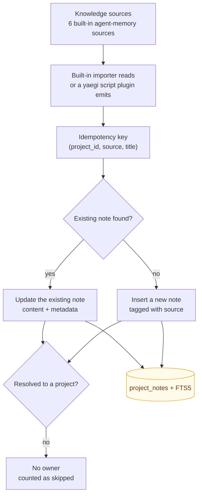

# Knowledge Source Import

> ⚠️ **Experimental**: the plugin system interface may change and is not a platform extension direction (see [ADR-0006](../adr/0006-scope-freeze.md)).

RepoNest imports documents into the knowledge base idempotently. Six sources ship **built in** as ordinary Go implementations of `plugin.KnowledgeImporter`; yaegi only carries *user-authored script* plugins, so the built-in path does not depend on the interpreter at all.

How to read it: both entry points (the built-in agent-memory sources, and plugin scripts) **converge on one upsert path**, and idempotency is guaranteed by the triple `(project_id, source, title)`. Re-importing therefore **updates** rather than creating duplicates — running the import again never makes the knowledge base dirtier. Writes go through a trigger that syncs the FTS index, so imported documents are immediately searchable via `reponest_notes_search`.

Note the last branch: **a document that cannot be matched to a project is not stored at all** — it is only counted in `skipped`. When `openclaw` / `hermes` have no target project configured, every one of their documents lands in this branch.

## Built-in knowledge sources

| Source | Trigger | Reads | Notes |
|--------|---------|-------|-------|
| `claude` | **automatic** | `~/.claude/projects/*/memory/*.md` | skips `MEMORY.md`; skips files over 100 KB |
| `codex` | manual | `~/.codex/sessions/**/rollout-*.jsonl`, `~/.codex/archived_sessions/**` | first user instruction + last assistant reply per session |
| `opencode` | manual | `$XDG_DATA_HOME` / `~/.local/share/opencode/storage/session/**/*.json` | session title + summary |
| `openclaw` | manual | `~/.openclaw-autoclaw/workspace/*.md` | single level, never recursive; **requires a target project** |
| `hermes` | manual | `$HERMES_HOME` / `~/.hermes/memories/{MEMORY,USER}.md` | **requires a target project** |
| `cursor` | manual | `<config>/Cursor/User/globalStorage/state.vscdb` (override with `CURSOR_STATE_DB`) | read-only; first prompt + last reply; an unrecognized layout **fails the whole source** |

"Automatic" means the source runs at startup together with `auto_import` (**off by default**; enable it explicitly in **Settings → Plugins**). "Manual" means it only runs when you click that source in **Settings → Plugins** — those are raw session transcripts, large and noisy, which is why they never belong in a startup rescan.

### Project ownership

Four of the sources carry a project hint of their own (Claude's `-Users-x-Work-Foo` directory name, the session's `cwd`, OpenCode's `directory`, and Cursor's `workspaceId → workspaceStorage/<id>/workspace.json` folder path). The **last path segment** is matched with a three-step rule: exact project name → repository path ending with that segment → project name containing it. No match means the document has no owner and is counted as `skipped`; it is **never** dumped into some "uncategorized" project.

`openclaw` and `hermes` files contain no project hint at all, so their target project comes from configuration:

| Config key | Purpose |
|------------|---------|
| `openclaw_project` | project name or project ID that openclaw notes attach to |
| `hermes_project` | project name or project ID that hermes notes attach to |

> ⚠️ **With no value set, both sources skip everything silently**: the import reports no error, every document lands in `skipped`, and not one note is created. The settings page shows no reason — only the `skipped` count gives it away. Set the corresponding key before using either source for the first time.

### Import statistics

Each run returns `{created, updated, skipped}`:

- `created` — notes inserted
- `updated` — notes hit by the idempotency key and refreshed (a re-import puts everything here)
- `skipped` — documents **that matched no project**, plus oversized or unparseable files

So "importing twice yields `updated=6, created=0`" is the proof idempotency worked, not evidence that nothing happened.

Startup auto-import is toggled in **Settings → Plugins** (the `auto_import` config item, **off by default**: reading another tool's memory files and writing them into this database is privacy-relevant, so it requires an explicit opt-in; upgrading normalizes a legacy "on" to "off" — see CHANGELOG). Manual triggering is available on the same page.

### Headless mode

`cmd/server` (the standalone API service started with `--port`) runs the same startup sequence as the desktop app, so source registration and `auto_import` behave identically: `GetKnowledgeSources`, `TriggerKnowledgeImport` and `TriggerAllKnowledgeImports` all work through `/api/rpc`.

## Idempotent import semantics

The runtime upserts on `(project_id, source, title)`: importing the same content again **updates** the existing note instead of creating a duplicate.
