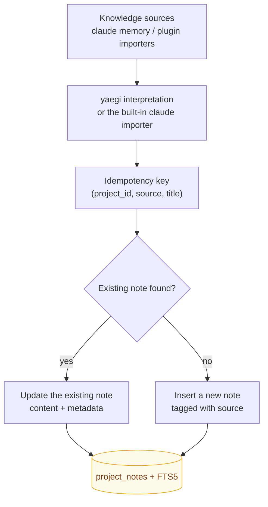

# Knowledge Source Import

> ⚠️ **Experimental**: the plugin system interface may change and is not a platform extension direction (see [ADR-0006](../adr/0006-scope-freeze.md)).

RepoNest supports idempotently importing documents into the knowledge base through Go scripts interpreted by yaegi.

How to read it: the two entries (built-in `claude` memory, plugin scripts) **converge on one upsert path**, and idempotency is guaranteed by the triple `(project_id, source, title)`. Re-importing therefore **updates** rather than creating duplicates — running the import again never makes the knowledge base dirtier. Writes go through a trigger that syncs the FTS5 index, so imported documents are immediately searchable via `reponest_notes_search`.

## Built-in knowledge sources

| Source | Description |
|----|------|
| `claude` | Imports `~/.claude/projects/*/memory/*.md`, matching ownership by project name / repository path |

Startup auto-import is toggled in **Settings → Plugins** (the `auto_import` config item, **off by default**: reading another tool's memory files and writing them into this database is privacy-relevant, so it requires an explicit opt-in; upgrading normalizes a legacy "on" to "off" — see CHANGELOG). Manual triggering is available on the settings page.

## Idempotent import semantics

The runtime upserts by `(project_id, source, title)`: importing the same content again **updates** the existing note instead of creating a duplicate.
