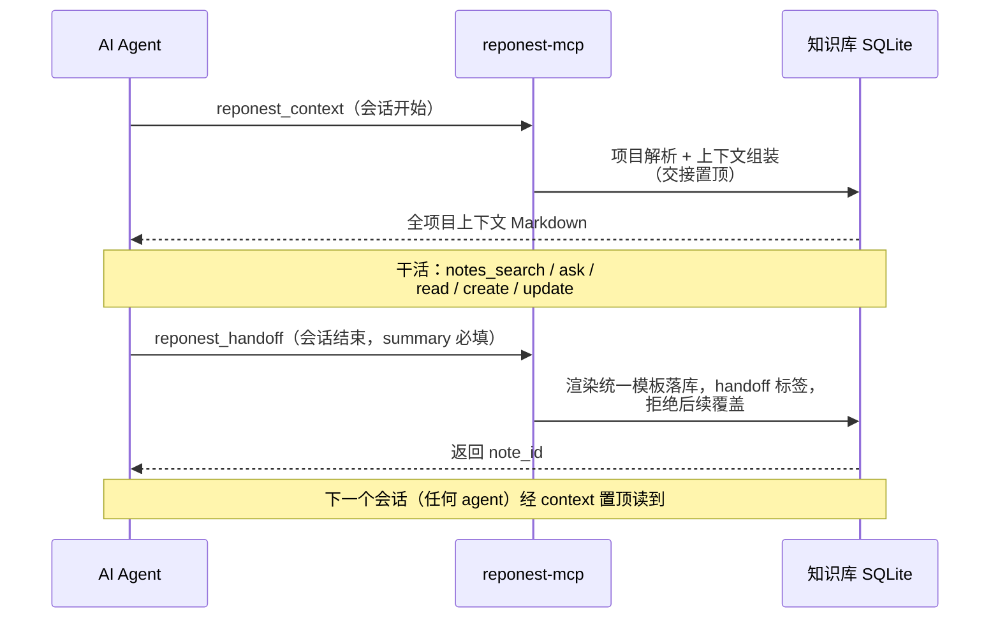

# AI 集成

RepoNest 面向 AI 代理提供读取通道与自检工具，全部复用同一 `internal/service` 实现（与桌面端行为一致）。

## 价值定位：RepoNest 是 AI 的数据源，而非 AI 平台

**RepoNest 不托管模型、不代持密钥、不自带 agent 编排。** 更准确地说：它是**数据底座**——把 git 原始信息建模成结构化、可索引、可物化的本地知识库（详见[存储结构优化与 AI 价值](../storage-optimization.md)）；AI 工具（Claude Code / Cursor 等）通过 MCP 的 13 个工具来**消费**这层数据，按需取数、精确检索。

这一层「为什么比让 AI 直接读 git 更优」的论证，见[存储结构优化与 AI 价值](../storage-optimization.md)。

需要明说的边界：早期版本这里写的是「RepoNest 不调用任何大语言模型」。**这句话已经被产品自己推翻**——AI 问答（v1.15.0）会打 OpenAI 兼容的 `/chat/completions`，可选的语义检索会打 `/v1/embeddings`。真实的定位是上面那句：模型与端点**由用户自备**，相应能力**默认关**，密钥只存不外传。之所以要较真这个区别，是因为它决定了隐私责任的落点——「不内置 AI」意味着没有任何一行笔记会在你没显式开启、没填自己端点的情况下离开这台机器；而「内置了 AI」就不是这个承诺了。

### 配置项

`internal/service/config.go` 的白名单分两组。**核心配置与模型 / API 完全无关**：

| 键 | 类型 | 默认 | 用途 |
|----|------|------|------|
| `auto_import` | 0 / 1 | **`0`（未发布的破坏性变更：旧库会被一次性归零）** | 启动时是否自动导入知识源（当前只有 `claude` 是自动源，其余 4 个需手动触发）。**只有值为 `1` 才开**：行缺失、空串、乱值一律视为关——旧判据是「不等于 `0` 就算开」，而配置读取把「无行」返回成空串，等于**从未设置过的人被默认放行**，这是本次修掉的真 bug |
| `daily_code_standard` | 整数 | `500` | 每日代码行数目标，用于仪表盘达标展示。名字带 “code standard” 但非 AI 规范，易误读 |
| `scan_depth` | 整数 | `2` | 扫描目录深度 |
| `git_author` | 字符串 | 系统 git 用户 | 影响「我的」统计 / 热力图归属 |

**AI 侧配置全部可选、全部默认关**，且都要你自己填端点——RepoNest 不带任何服务：

| 键 | 默认 | 用途 | 开了会把什么发出去 |
|----|------|------|-------------------|
| `claude_session_capture` | 关 | 允许按需读取 Claude 会话转录做交接（[ADR-0010](../adr/0010-session-auto-capture.md)） | 无外发，但会读盘上转录 |
| `openclaw_project` / `hermes_project` | 空 | 两个 agent 全局记忆源的归属项目；不设则该源整批 skip | 无 |
| `semantic_search` + `embedding_base_url` / `embedding_model` / `embedding_api_key` / `embedding_dim` | 关 / 空 | 向量召回补 FTS5 盲区（[ADR-0012](../adr/0012-semantic-search.md)） | **笔记文本** → 你的 embedding 端点 |
| `vector_store` + `vector_store_url` / `vector_store_api_key` / `vector_store_collection` | `local` | 向量存哪：本地 sqlite-vec 或远程 Qdrant / Weaviate（[ADR-0013](../adr/0013-vector-database-selection.md)） | 向量（非原文）→ 你的远程库 |
| `ai_chat_base_url` / `ai_chat_model` / `ai_chat_api_key` | 空 | 项目详情页的 AI 问答 | 提问 + 打包的项目上下文 → 你的 chat 端点 |

两个密钥键（`embedding_api_key` / `vector_store_api_key`，以及 `ai_chat_api_key`）在读取配置时以掩码返回、不回传界面——后端持真值，界面只显示 `********`。

## 语义检索与向量存储（可选）

词法检索答不了「同一件事的另一种说法」，向量召回补的是这个盲区。整条链路默认关，且**任何失败都退回纯词法结果**——开启它不会让搜索结果变少（[ADR-0012](../adr/0012-semantic-search.md)）。

- **引导式配置**：`go run ./cmd/vector-init`。它会自检 sqlite-vec 是否装载（建 vec0 → 写测试向量 → KNN 往返 → 清理），让你选 embedding provider（本地 Ollama 为默认推荐，或任意 OpenAI 兼容远端），写入配置，最后指向应用内设置复核。加 `-store qdrant`（或 `weaviate`）可写远程向量库并当场探测；**不可达或未配则自动退回本地**，不会让检索变少。
- **首次要跑一次全量重建**（O(全部笔记) 次文本送端点）。之后不需要再重建：笔记的新建、标题/正文修改、删除由数据库触发器排队，后台每 5 秒批量排空；已删除的笔记会从向量索引里移除。维度未知或索引尚未建立时排空器直接跳过且不消费队列（猜维度意味着可能 drop 整个索引），端点不可达时任务原地保留、下一轮重试。细节见[知识库与笔记](knowledge.md) 的「语义检索」。
- **效果先量化再放开关**：`go run ./cmd/abeval` 对活库跑「词法 vs 词法+向量」的 Recall@k / NDCG@k 与差值门判定。在真实标注 query 集与门槛通过之前，设置页刻意不放这个开关——宁缺毋滥。

## AI 问答：今天是什么样

项目详情页的悬浮球面板里有 AI 问答 tab（v1.15.1 起从详情页头部并入面板，与「记录」共享外壳与项目选择器）。诚实描述当前实现，别把它读成 RAG：

- 上下文是**静态打包**：项目下仓库列表（≤15）+ 第一个仓库的挖掘缓存（技术栈 / 语言 / README 摘要）+ **最近 10 条笔记，每条截断到 500 字节**，拼进 system prompt。
- 一次 POST 到 OpenAI 兼容 `/chat/completions`（LM Studio、Ollama shim 或云端皆可），**非流式、无工具调用、无检索排序、无引用**。
- 也就是说它「塞上下文」而不是「取证」——不保证相关的笔记被读到，不保证读到的都进答案。把它改造成真正的检索取证（读 index → FTS+向量选页 → 带引用作答 → 好答案可回档成新页 + 条数/字符/超时三重预算封顶 + 流式）是 [ADR-0014](../adr/0014-llm-wiki-knowledge-compiler.md) 的 M6-W2，门槛是过上面那个 `abeval` 评测门。
- 不想让任何内容离开这台机器的话，用详情页的**复制 AI 上下文**：它把打包好的 prompt 交给剪贴板，由你决定贴给谁，不经过任何端点。

## 无头 HTTP 服务与可执行清单

MCP 之外还有一条同源的通道：把 `internal/service` 暴露成 loopback HTTP，供浏览器模式、脚本和其它 agent 调用。

```
go build -o reponest-server ./cmd/server
./reponest-server --port 18765        # 或 env REPONEST_HTTP_PORT；只监听 127.0.0.1
```

- `POST /api/rpc` 用反射覆盖桌面端绑定的全部方法（JSON body 指定 method + args），与 Wails 走的是**同一份实现**；`Startup` / `Shutdown` / `Service` 本身被屏蔽。写操作与 MCP 遵守同一套协议保护（例如交接笔记拒绝被 update 覆盖）。
- 浏览器开发模式用 `bash scripts/dev.sh`：它同时起无头 API（默认 18731）与 Vite。只跑 `npx vite` 会得到一个「页面能开、每个请求都 502」的假象——那是缺后端，不是应用坏了。
- **发布资产里只有**：桌面安装包（4 平台）、`reponest-mcp-<平台>`、VS Code 扩展 VSIX。`reponest-server`、`cmd/vector-init`、`cmd/abeval`、`cmd/reponest-capture` 都需自行 `go build`（或 `go run`），未随版本分发。

## MCP Server（`reponest-mcp`）

MCP 是唯一的 AI 执行接口（`reponest` CLI 未随版本发布）。stdio 协议，进程内单次开库，13 个工具（含 4 个写操作：扫描 + 笔记创建/更新 + 会话交接）：

会话记忆协议的两端在时序上是这样落位的：



读图：整个协议只有**两个入口调用**——开会话 `reponest_context`、收会话 `reponest_handoff`，中间的工作期走的是普通读写工具。两条关键保证：交接笔记**写入一次即带 `handoff` 标签**，且 `reponest_notes_update` 拒绝覆盖它（所以下一个会话读到的始终是同一条记录，置顶渲染）；落库走的是统一模板，不是自由文本。

| 工具 | 说明 | 读写 |
|------|------|------|
| `reponest_scan` | 冷启动：播种默认扫描根目录并同步扫描，发现本地 Git 仓库（纯 MCP 安装可用，无需桌面应用） | 写 |
| `reponest_context` | 会话开始一次注入项目全上下文（技术栈 / README / 待办 / 高相关笔记，交接笔记置顶） | 读 |
| `reponest_handoff` | 会话结束结构化交接（summary/changes/decisions/gotchas/next_steps），落库并供下次 `reponest_context` 置顶读取；落库笔记带 `handoff` 标签，`reponest_notes_update` 拒绝覆盖 | 写 |
| `reponest_notes_list` | 全部笔记 | 读 |
| `reponest_notes_search` | FTS5 搜索（query） | 读 |
| `reponest_notes_read` | 按 ID 读笔记 | 读 |
| `reponest_notes_create` | 新建知识笔记 | 写 |
| `reponest_notes_update` | 更新笔记内容与元数据（部分更新；拒绝覆盖 `handoff` 协议笔记） | 写 |
| `reponest_projects_list` | 全部项目 | 读 |
| `reponest_projects_stats` | 项目统计（按 id） | 读 |
| `reponest_ask` | 问答式检索，Top-5 文本 | 读 |
| `reponest_agent_score` | 检查本地 AI 就绪度（DB/笔记/搜索/MCP/llms.txt/SKILL.md/i18n） | 读 |
| `reponest_integrity` | 审计数据可信度（FTS 索引漂移 / 孤儿行 / 缓存新鲜度 / 覆盖率） | 读 |

### 就绪度 vs 数据可信度

两个自检工具问的是**不同的问题**，不要混用：

| 工具 | 回答的问题 | 不能回答的问题 |
|------|-----------|----------------|
| `reponest_agent_score` | 这个安装配置好了吗？（有没有笔记、MCP 通不通、i18n 齐不齐） | 数据本身对不对 |
| `reponest_integrity` | 数据还能信吗？（索引有没有漂移、有没有孤儿行、缓存新不新鲜） | 配置齐不齐 |

**为什么需要第二个**：FTS5 索引一旦与 `project_notes` 失配，搜索会**静默少返回结果**，而 `agent_score` 依然会报「Search operational」——它测的是通路，不是内容。`reponest_integrity` 用 FTS5 的 `_docsize` 影子表（external-content 表的 `SELECT rowid` 读的是内容表，比不出来）对比索引真实文档数，并检查同步触发器是否齐全。详见 [`internal/integrity` 的检查清单](../../internal/integrity/integrity.go)。

当 AI 发现「搜出来的东西好像不全」时，应该先跑 `reponest_integrity`，而不是直接下结论说知识库内容少。

### 一键注册（reponest-init，推荐）

[ADR-0009](../adr/0009-ide-presence.md) 的第一步：一条命令完成二进制探测与客户端注册，幂等可重复执行：

```bash
node scripts/reponest-init/index.mjs --with-hook
```

- 自动探测 `reponest-mcp`（`--bin` 可显式指定），向 Claude Code（`.mcp.json`）、Cursor（`.cursor/mcp.json`）、VS Code（`.vscode/mcp.json`）、Windsurf 写入注册（配置只落在对应客户端目录已存在的地方），JetBrains 打印手动指引
- `--with-hook` 同时安装下方的 SessionEnd hook（脚本 + `settings.json` 合并，改前备份）
- `--dry-run` 预览全部写入动作；找不到二进制时给出安装引导，`--yes` 以裸命令名 `reponest-mcp` 写入配置（装好即生效）

### 手动接入 Claude Code（备选）

```bash
claude mcp add reponest -- /path/to/reponest-mcp
```

或写入 `.mcp.json`（项目级）/ `~/.claude.json`（用户级）：

```json
{
  "mcpServers": {
    "reponest": { "command": "/usr/local/bin/reponest-mcp", "args": [] }
  }
}
```

### 会话结束自动交接（SessionEnd hook）

「零成本沉淀」的真实含义不是「agent 记得自觉调用」——靠自觉等于没有承诺。Claude Code 的 **SessionEnd hook** 把交接变成会话生命周期的一部分：会话一结束，交接必然发生，不依赖 agent 的记性。这也是新用户装完第一天就能感受到「下次开局即带全上下文」的路径。

写入 `.claude/settings.json`（项目级，随仓库分享给协作者）：

```json
{
  "hooks": {
    "SessionEnd": [
      {
        "hooks": [
          {
            "type": "command",
            "command": "\"$CLAUDE_PROJECT_DIR\"/.claude/hooks/reponest-handoff.sh"
          }
        ]
      }
    ]
  }
}
```

配套脚本 `.claude/hooks/reponest-handoff.sh`（记得 `chmod +x`）：

```sh
#!/bin/sh
# SessionEnd hook: make the handoff automatic instead of relying on the
# agent's goodwill. One bounded headless turn costs a fraction of the
# session it preserves; "the agent will remember to call handoff" costs
# the entire exit record whenever it forgets.
set -u
cd "${CLAUDE_PROJECT_DIR:-$(pwd)}" || exit 0
command -v claude >/dev/null 2>&1 || exit 0
claude -p --mcp-config .mcp.json \
  'This session ended. Call reponest_handoff for the current project: a concise summary plus next_steps. If the project cannot be resolved, call reponest_context once first. Do nothing else.' \
  >/dev/null 2>&1 || true
```

设计要点与代价（写清楚，别让叙事变成吹牛）：

- **触发时机**：会话结束时由 Claude Code 触发，触发原因（`clear` / `logout` / `prompt_input_exit` / `other`）以 JSON 形式写入 stdin；脚本可读 stdin 按需跳过（例如「只是清了上下文」不必交接）。
- **成本**：一次有界的 headless 回合（`claude -p`），远小于它保存的整场会话上下文；hook 有默认超时（60s），脚本以 `|| true` 静默收尾，不影响会话退出。
- **降级路径**：没有 `claude` CLI 时直接跳过；MCP 未注册时 headless 调用失败并被吞掉——协议要求交接必须由 `reponest_handoff` 写入，hook 只负责「必定触发」，从不绕过协议直写数据库。
- **协议保护**：交接笔记带 `handoff` 标签，`reponest_notes_update` 拒绝覆盖它们（防误覆盖），下一次会话由 `reponest_context` 置顶完整渲染。
- hook 的事件名与配置字段随 Claude Code 版本演进，接入前以 `claude --help` 和官方 hooks 文档为准。

### 接入 Cursor / 其他 MCP 客户端

在对应客户端的 MCP 配置中添加同样的 `command` 指向 `reponest-mcp` 二进制（Cursor：`Settings → MCP → Add Server`）。

## llms.txt 与 Markdown 导出（应用内）

- **llms.txt**：`GenerateLLMsTxt` 生成知识库总览 Markdown（项目目录 + 技术栈 + 最近 20 条知识笔记），适合喂给 LLM 建立上下文。**llms.txt 是导出格式**（应用内生成，不随仓库分发），不作为独立产品方向扩张（见 ADR-0006）
- **笔记导出**：任意笔记导出为带 YAML frontmatter 的 `.md`（`ExportNoteAsMarkdown`）
- **Claude 记忆导入**：`~/.claude/projects/*/memory/*.md` 幂等导入（见[知识库](knowledge.md)）

## agent-score 自检

agent-score 已合并为 MCP 工具 `reponest_agent_score`，无需独立构建。通过任意 MCP 客户端调用即可获取 7 项 AI 就绪度评分。

## 为什么不直接让 AI 读 git 仓库

一个常见疑问：既然 Claude Code / Cursor 都能直接 `git log`、读文件，为什么还要经过 RepoNest？核心答案是**成本与确定性**：

- **读得贵**：每次让 AI 直接 `git log` 或逐文件扫描都是一次性消费，重复读 = 重复 token；
- **读得乱 / 不全**：大仓必超上下文窗口、被截断，模型还可能幻觉或漏读二进制 / `.gitignore`；
- **读得慢**：每次重算统计，秒级任务退化成分钟级。

RepoNest 在**扫描时一次性**把 git 原始数据解析并物化进本地 SQLite（`daily_stats` 预聚合统计、`repo_meta` 缓存挖掘结果、`project_notes_fts` 建全文索引），之后 AI 只通过 MCP 工具**按需取数、精确命中**。完整对比与存储结构细节见[存储结构优化与 AI 价值](../storage-optimization.md)。

## 面向 AI 代理的技能卡

仓库根目录的 [SKILL.md](https://github.com/sky-jiangcheng/repo-nest/blob/master/SKILL.md) 是给代理阅读的能力卡片（命令、工具表、路径），可直接投喂。
