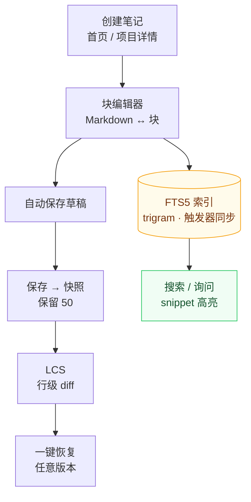

# 知识库与笔记

知识库是应用首页，也是跨项目的笔记中心：Markdown / 块编辑器、标签分类、FTS5 全文搜索、版本历史与 AI 记忆导入。

读图：一条**主干（编辑→保存→快照→diff→恢复）+ 一条旁路（索引→搜索）**。主干解决“知识不能丢”，旁路解决“知识能被找到”——两者都由保存动作同时触发（快照走写入触发器，索引走 FTS 同步触发器），因此不需要用户记得点任何“保存”按钮。点击笔记卡片的 **历史** 按钮进入版本侧，搜索框进入旁路侧。

## 笔记管理

- **创建笔记**：首页「快速创建笔记」选择所属项目；或项目详情页笔记面板新建
- **元数据**：标题（留空取首行）、标签（逗号分隔）、分类（知识 / 日志 / 想法 / 其他）、置顶
- **跨项目迁移**：编辑状态下「关联项目」下拉一键迁移
- **草稿自动保存**：编辑内容实时存入本地，意外关闭不丢失

## 块编辑器

输入 `/` 呼起块面板，插入结构化块：

| 块 | 说明 |
|----|------|
| Callout | TIP / WARNING / NOTE 提示块 |
| 代码块 | 带语言高亮 |
| Mermaid 图 | 流程图 / 时序图等 |
| 数学公式 | KaTeX 渲染 |
| 待办列表 / 表格 / 分隔线 | 常用结构 |
| 折叠块 / Tabs | `
` 与 `` |

- 块可拖拽排序、上下移动、独立删除
- **Markdown ↔ 块双轨随时切换**：存储格式始终是纯 Markdown，任何编辑器都能打开

## 富渲染

highlight.js 代码高亮、Mermaid 图、KaTeX 数学公式、GFM Callout 与任务列表。

## 搜索

- 首页搜索框自动聚焦；「询问知识库」模式返回带相关性的答案片段
- FTS5 trigram + bm25 排序，snippet 高亮匹配词；短 CJK 查询自动降级 LIKE
- 覆盖笔记与待办；`⌘/Ctrl+K` 命令面板随时可用

## 版本历史

每次保存自动创建快照（保留最近 50 个）。笔记卡片 **历史** 按钮：

- 版本列表（时间、标题）
- 查看任意版本与当前的行级 LCS diff（+/- 标记）
- 一键恢复到任意历史版本

## 从 agent 记忆导入知识库

应用内置 5 个知识源，把你在各 agent 工具里留下的记忆/会话转录幂等导入为知识笔记（重复导入更新而非重复创建）：

| 源 | 触发 | 读什么 |
|----|------|--------|
| `claude` | 启动自动 | `~/.claude/projects/*/memory/*.md` |
| `codex` | 手动 | 会话转录 `rollout-*.jsonl`（首条指令 + 末条回复） |
| `opencode` | 手动 | 会话标题与摘要 |
| `openclaw` | 手动 | `~/.openclaw-autoclaw/workspace/*.md` |
| `hermes` | 手动 | `~/.hermes/memories/{MEMORY,USER}.md` |

**设置 → 插件** 可查看全部导入源、逐个手动触发，并看到每个源的 `{created, updated, skipped}` 统计。

三条容易踩的规则：

1. **导入按项目归属，不是全堆进知识库首页。** 文档靠项目名 / 仓库路径匹配到具体项目，匹配不上的计入 `skipped` 而不入库。所以先扫描入库项目、再导入，命中率才高。
2. **`openclaw` 与 `hermes` 需先配置目标项目**（`openclaw_project` / `hermes_project`），否则静默全部 `skipped`。
3. **重复导入不是失败。** `created=0` + `updated=N` 说明幂等命中，内容已更新。

导入的笔记 `kind` 为 `knowledge`（记忆类）或 `log`（会话类），写入后立即可被全文搜索命中。各源的完整路径、匹配规则与限制见 [知识源导入](../plugins/overview.md)。

## 导出

笔记卡片 **导出 .md**：带 YAML frontmatter（标题 / 标签 / 项目 / 类型 / 更新时间）的 Markdown 复制到剪贴板。批量 AI 消费见 [AI 集成](ai-integration.md) 的 llms.txt。
