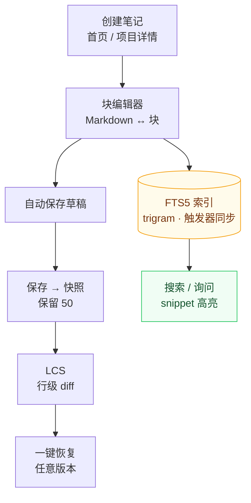

# 知识库与笔记

知识库是应用首页，也是跨项目的笔记中心：Markdown / 块编辑器、标签分类、FTS5 全文搜索、版本历史与 AI 记忆导入。



读图：一条**主干（编辑→保存→快照→diff→恢复）+ 一条旁路（索引→搜索）**。主干解决“知识不能丢”，旁路解决“知识能被找到”——两者都由保存动作同时触发（快照走写入触发器，索引走 FTS 同步触发器），因此不需要用户记得点任何“保存”按钮。点击笔记卡片的 **历史** 按钮进入版本侧，搜索框进入旁路侧。

## 笔记管理

- **创建笔记**：首页「快速创建笔记」选择所属项目；或项目详情页笔记面板新建
- **元数据**：标题（留空取首行）、标签（逗号分隔）、分类（知识 / 日志 / 想法 / 其他）、置顶
- **跨项目迁移**：编辑状态下「关联项目」下拉一键迁移
- **草稿自动保存**：编辑内容实时存入本地，意外关闭不丢失

## 块编辑器

输入 `/` 呼起块面板，插入结构化块：

| 块 | 说明 |
|----|------|
| Callout | TIP / WARNING / NOTE 提示块 |
| 代码块 | 带语言高亮 |
| Mermaid 图 | 流程图 / 时序图等 |
| 数学公式 | KaTeX 渲染 |
| 待办列表 / 表格 / 分隔线 | 常用结构 |
| 折叠块 / Tabs | `<details>` 与 `` |

- 块可拖拽排序、上下移动、独立删除
- **Markdown ↔ 块双轨随时切换**：存储格式始终是纯 Markdown，任何编辑器都能打开

## 富渲染

highlight.js 代码高亮、Mermaid 图、KaTeX 数学公式、GFM Callout 与任务列表。

## 搜索

- 首页搜索框自动聚焦；「询问知识库」模式返回带相关性的答案片段
- FTS5 trigram + bm25 排序，snippet 高亮匹配词；短 CJK 查询自动降级 LIKE
- 覆盖笔记与待办；`⌘/Ctrl+K` 命令面板随时可用

### 语义检索（可选，默认关）

词法搜索回答「哪些字面命中」，答不了「同一件事的另一种说法」。可选的向量召回补的是这个盲区：

- **两级检索融合**：FTS5 与向量召回经 RRF（k=60）合并，向量只做**补充**——任何一步失败（端点未配、请求报错、索引不存在）都退回纯词法结果，**开启它不会让搜索结果变少**。这是设计约束不是安慰话：语义检索的第一版就是靠这条约束才敢默认关着上线。
- **默认关**：仅当 `semantic_search=1` **且**配好 embedding 端点（`embedding_base_url` + `embedding_model`）时才生效。设置页目前不提供这些开关，需按 [AI 集成](ai-integration.md) 的「语义检索与向量存储」一节用配置键开启。
- **首次要跑一次全量重建**：把每条笔记的文本送去 embed，成本是 O(全部笔记) 的端点遍历。它会顺带把探测到的向量维度持久化下来。
- **之后不需要再重建**：笔记的新建、改标题/正文、删除由 SQLite 触发器排队，后台每 5 秒批量排空——还在的笔记重新 embed，已删除的从向量索引里移除（否则你删掉的文本会一直出现在召回结果里）。三条保守行为：置顶 / 改标签 / 移动项目**不**触发 embed（它们不改变送进端点的文本）；端点不可用时任务原地排队、下一轮重试，所以离线不会丢写；维度未知或索引还没建时直接跳过，不猜。
- **导入的笔记同样自动进索引**：排队由数据库触发器负责，而所有写入者（界面、MCP、CLI、agent 记忆导入）都收敛到同一层——这也是为什么它没做在应用逻辑里。
- **隐私边界**：开启语义检索意味着笔记文本会发往你配置的 embedding 端点（本地 Ollama 或远端 API，取决于 `embedding_base_url`）。这是显式选择，默认关着；`embedding_api_key` 与 `vector_store_api_key` 是密钥，读取配置时以掩码返回、不回传给界面。
- **向量索引是派生缓存**，笔记本体才是事实源：随时可以 drop 并从笔记重算，与笔记同库同事务同备份（零 CGO 的纯 Go sqlite-vec）。确有大规模需求才需要远程向量库，见 [AI 集成](ai-integration.md) 的「语义检索与向量存储」一节。
- **效果不好可以量化验证**：`cmd/abeval` 对活库跑「词法 vs 词法+向量」的 Recall@k / NDCG@k 并给出门槛判定。刻意先有门再有开关——没有真实标注 query 集之前，前端不放这个开关。

## 版本历史

每次保存自动创建快照（保留最近 50 个）。笔记卡片 **历史** 按钮：

- 版本列表（时间、标题）
- 查看任意版本与当前的行级 LCS diff（+/- 标记）
- 一键恢复到任意历史版本

## 从 agent 记忆导入知识库

应用内置 6 个知识源，把你在各 agent 工具里留下的记忆/会话转录幂等导入为知识笔记（重复导入更新而非重复创建）：

| 源 | 触发 | 读什么 |
|----|------|--------|
| `claude` | 启动自动 | `~/.claude/projects/*/memory/*.md` |
| `codex` | 手动 | 会话转录 `rollout-*.jsonl`（首条指令 + 末条回复） |
| `opencode` | 手动 | 会话标题与摘要 |
| `openclaw` | 手动 | `~/.openclaw-autoclaw/workspace/*.md` |
| `hermes` | 手动 | `~/.hermes/memories/{MEMORY,USER}.md` |
| `cursor` | 手动 | Cursor `globalStorage/state.vscdb` 的会话（best-effort，见下） |

**设置 → 插件** 可查看全部导入源、逐个手动触发，并看到每个源的 `{created, updated, skipped}` 统计。

三条容易踩的规则：

1. **导入按项目归属，不是全堆进知识库首页。** 文档靠项目名 / 仓库路径匹配到具体项目，匹配不上的计入 `skipped` 而不入库。所以先扫描入库项目、再导入，命中率才高。
2. **`openclaw` 与 `hermes` 需先配置目标项目**（`openclaw_project` / `hermes_project`），否则静默全部 `skipped`。
3. **重复导入不是失败。** `created=0` + `updated=N` 说明幂等命中，内容已更新。

**`cursor` 是唯一标 best-effort 的源**：Cursor 的落盘格式未公开且带版本位，所以它只取每场会话的**首条提问 + 末条回复**（不复制整段转录），归属靠 `workspaceStorage/<id>/workspace.json` 的 folder 反查项目——查不到就跳过，绝不猜；而一旦库表结构不是它认识的形状，**整个源直接报错而不是安静导入 0 条**（"没导入"和"你没会话"必须可区分）。读取全程 `mode=ro`，绝不写别人的库。

导入的笔记 `kind` 为 `knowledge`（记忆类）或 `log`（会话类），写入后立即可被全文搜索命中；开启语义检索后也会被向量召回取到，且**不需要再跑一次重建**（排队由触发器负责，见「语义检索」）。各源的完整路径、匹配规则与限制见 [知识源导入](../plugins/overview.md)。

## 知识页面与审核队列

笔记是**原始记录**，页面是**编译产物**。同一个事实可以先记在笔记里（谁在什么时候怎么处理的），再由它长出概念页/实体页，页面之间用有向链接连成图——这是 `project_notes` 本身给不了的形状：笔记只挂项目、互相之间没有任何引用。

| 页面类型 | 装什么 |
|---------|--------|
| `entity` | 一个具体东西（模块、服务、仓库、人物） |
| `concept` | 一个概念（幂等键、会话超时、扫描深度语义） |
| `source` | 某一份来源材料的摘要页 |
| `synthesis` | 跨来源的综述与结论 |
| `query` | 一次好问答的回档（见 [AI 集成](ai-integration.md) 的"存为页面"） |

页面层是**派生缓存**：笔记才是事实源，整层可以随时丢掉重建（`DropWikiSchema`），且丢完重启会自动长回来。

### 待审核与已批准（最容易被误误解的一条）

页面有状态，而状态决定它能不能回答问题：

- `approved`：进入知识库搜索、进入导出索引、可作为 AI 问答的依据。
- `pending`：**看得见但搜不到**。列表、导出旁路、审核队列、lint 都能看到它；检索与问答刻意看不见它。

所以"我明明生成了页面，怎么搜不到"不是 bug，而是设计：模型写出来的东西默认待审，**只有人批准才会进检索**。手工在应用里创建的页、以及你点"存为页面"回档的问答，都直接是 `approved`（那是人做的动作），只有编译器产出的页才落 `pending`。拒绝一个待审页 = 删掉那一行并连带带走它的链接与来源挂接；已批准的页不能通过"拒绝"删除。

### 谁在写页面

1. **人**：问答回档（`query`），或将来的人工建页。
2. **编译器**（`wiki_compile` 开启后）：读一条笔记，提出"新建哪些页 / 加哪些链接 / 声明哪些来源"，全部以 `pending` 落库。它**只能新建，不能修改任何已批准的页**——想修订就变成一条待办给人看。每产出一页都会自动挂上它读的那条笔记作为来源。
3. **lint**（只读）：检查图的健康度，永不改页。

### lint：五查与它的产出

`RunWikiLint` 跑五项检查：孤页、缺交叉引用、数据缺口（薄页 / 无来源笔记 / 正文链接指向不存在的页 / 有零散页却零综述）这三项纯 SQL 判定；矛盾与过时声明两项走模型，需要 `wiki_lint_llm` 显式开启。所有发现都只写成项目待办（前缀 `[lint]`），重复跑不会堆重复条目（只对未完成的同名待办去重；勾掉之后若再次漂移会重新出现，那是新事实）。另有一条硬约束：lint 的结论是给人看的建议，代码里不存在让它改页面的路径。

### 导出到 Obsidian（只读旁路）

```
go build -o reponest-wiki-export ./cmd/wiki-export
./reponest-wiki-export -out ./vault            # 目标目录有外来文件会被拒
```

渲染成 `vault/wiki/<entities|concepts|sources|synthesis|queries>/<slug>.md`，带 YAML frontmatter（含 `status` 与 `source`）、`[[wikilink]]` 出链与反向链接、`wiki/index.md` 目录页与 `EXPORT-MANIFEST.json` 清单。用途是**看图**：用 Obsidian 的 graph view 判断这套分类是不是你知识本来的形状。两个刻意的性质：

- **只出不进**：在 Obsidian 里改文件不会回到库里。这是设计而非缺功能——两处写入者会让版本、去重、链接一致性各做一套（见 [ADR-0014](../adr/0014-llm-wiki-knowledge-compiler.md) 决策 2）。
- **不删除**：被删掉的页留下的文件只会在报告里列为 stale，由你自己决定要不要清。导出物不声称拥有那棵树。

`index.md` 只列已批准页面，未审核的不会把人引过去；而待审页本身会连同 `status: pending` 一起导出，正好在那里给人审。

## 导出

- 笔记卡片 **导出 .md**：带 YAML frontmatter（标题 / 标签 / 项目 / 类型 / 更新时间）的 Markdown 复制到剪贴板。批量 AI 消费见 [AI 集成](ai-integration.md) 的 llms.txt。
- **OMP 风格记忆导出**（`ExportMemoryJSON`）：把知识库导出成 OMP（Open Memory Protocol）风格的 Memory Object 数组，供其它支持该协议的 agent 工具消费。**目前只有导出、没有导入**，且字段映射仍是 provisional——协议本身还没稳定，双向同步刻意没做。入口在应用内绑定层，尚无独立界面按钮。
