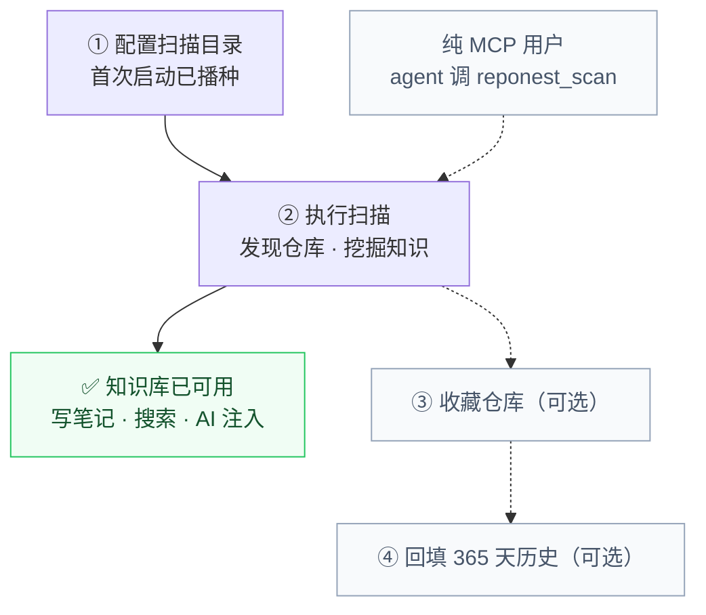

# 快速开始

RepoNest 是一款本地优先的桌面应用（Wails v2，单文件、零运行时依赖），核心价值是一层**跨 agent 的项目记忆层**：自动发现本机 Git 仓库，快速沉淀笔记、依赖、技术栈与活跃信息，便于你和任何 AI agent 检索复用。仪表盘与统计是支持能力，不是产品主入口。

## 下载安装

安装脚本会同时装上桌面应用和 `reponest-mcp`（AI 客户端用的 MCP 服务器）。

### macOS / Linux

```bash
curl -fsSL https://raw.githubusercontent.com/sky-jiangcheng/repo-nest/master/scripts/install.sh | bash
```

macOS 装到 `/Applications/RepoNest.app`，Linux 装到 `/usr/local/bin/reponest`；两者都会把 `reponest-mcp` 放进 `/usr/local/bin`。

### Windows

```powershell
iwr -useb https://raw.githubusercontent.com/sky-jiangcheng/repo-nest/master/scripts/install.ps1 | iex
```

或从 [GitHub Releases](https://github.com/sky-jiangcheng/repo-nest/releases) 下载对应平台的二进制文件。

## 首次启动

启动后直接打开桌面窗口（Wails 应用，无需浏览器）。

五分钟上手路径如下——前两步必做，后两步只影响仪表盘统计；纯 MCP 用户（不装桌面应用）可以让 agent 直接调一次 `reponest_scan`：



读图：实线路径是必做的；**实线与虚线的分界就是“知识库可用”的边界**——② 走完，笔记 / 搜索 / AI 注入就全部可用（见下方提示框），而 ③ ④ 只把仪表盘统计填满，不做任何事它们也照样能用。纯 MCP 用户走另一条虚线，让 agent 自己完成 ①②。

### 1. 配置扫描目录

首次启动会自动播种默认扫描根目录：

| 平台 | 默认扫描范围 |
|------|-------------|
| macOS | 当前用户 HOME 目录 |
| Linux | 当前用户 HOME 目录 |
| Windows | 除 C: 盘外的所有磁盘 |

可在 **设置 → 扫描目录** 中修改（支持添加 / 移除，扫描深度 1-2 级）。

### 2. 执行扫描

仪表盘点击 **重新扫描**，应用递归发现扫描根下的所有 Git 仓库并按目录智能分组为项目。

> 首次扫描仅登记仓库与项目，不预扫历史提交数据。
>
> **到这一步知识库已经可用**：可以写笔记、搜索、交给 AI（`reponest_context` / `reponest_handoff`）。下面的收藏与回填只影响仪表盘统计，不影响知识库。

### 3. 收藏仓库（可选，仪表盘统计）

在仪表盘中点击星标收藏关注的仓库。收藏后卡片展示完整统计（今日新增 / 文件 / 仓库数 / 净增 / 团队总量）。

### 4. 回填历史数据（可选，仪表盘统计）

在收藏的仓库卡片上点击 **刷新历史** 按钮，回填该仓库近 365 天的每日统计数据（进度环与热力图随即填充）。

### 5. 沉淀第一条知识笔记

前四步只是把仓库“登记”进来；让知识库真正开始有价值的，是留下一条谁都能复用的笔记。两条路径：

- **桌面端**：首页 **快速创建笔记** 选项目，写下“这个项目怎么跑起来的 / 坑在哪”（见[知识库](features/knowledge.md)）；
- **AI 侧**：会话结束自动写入 `handoff` 笔记，下一个会话开头自动置顶（见[AI 集成](features/ai-integration.md)）。

### 6. 导入已有的 agent 记忆（可选）

如果你在 Claude / Codex / OpenCode / OpenClaw / Hermes 里已经攒过记忆或会话记录，可以直接导成知识笔记，不用手抄。**设置 → 插件** 里能看到全部 5 个源：

- `claude` 记忆默认随应用启动自动导入，无需手动操作；
- 其余四个源在 **设置 → 插件** 逐个点击触发，每次会显示 `新增 / 更新 / 跳过` 三个数字；
- `openclaw` 与 `hermes` 导入前需先指定归属项目（否则会全部计为“跳过”）。

建议在第 3 步扫描完成之后再做这步 —— 导入靠项目名匹配归属，项目先入库了命中率才高。详见[知识源导入](plugins/overview.md)。

## 核心功能速览

| 功能 | 定位 | 说明 |
|------|------|------|
| 知识库 | 核心 | 跨项目笔记中心：Markdown、标签、置顶、FTS5 全文搜索、版本历史 |
| 仓库知识挖掘 | 核心 | 自动提取 README、技术栈、语言占比、依赖、贡献者、活跃度 |
| 项目理解与检索 | 核心 | 命令面板 `⌘/Ctrl+K`、全局搜索、项目上下文跳转 |
| AI 集成 | 核心 | llms.txt、笔记导出、MCP server（含 agent-score 自检，见[AI 集成](features/ai-integration.md)） |
| 仪表盘 | 支持 | 每日目标进度环、项目卡片、趋势折线图、提交热力图 |
| 插件系统 | 实验 | yaegi 进程内 Go 脚本 + 5 个内置知识源导入（见[知识源导入](plugins/overview.md)） |

各页展开的图：仪表盘的页面分层见[仪表盘](features/dashboard.md#页面结构自上而下)，笔记的保存与版本链路见[知识库](features/knowledge.md)，知识库为何比 AI 直读 git 更划算见[存储结构优化与 AI 价值](storage-optimization.md#二比-ai-直接读-git-仓库的优势)。

## 数据与日志位置

| 内容 | macOS | Windows | Linux |
|------|-------|---------|-------|
| 数据库 | `~/Library/Application Support/reponest/dashboard.db` | `%APPDATA%\reponest\dashboard.db` | `~/.config/reponest/dashboard.db` |
| 插件目录 | `…/reponest/plugins/` | `…/reponest\plugins\` | `…/reponest/plugins/` |
| 日志 | `~/Library/Logs/reponest.log` | `%APPDATA%\reponest\logs\reponest.log` | `$XDG_STATE_HOME/reponest/reponest.log`（默认 `~/.local/state/reponest/`） |

升级时 schema 自动迁移，数据无需手工处理。详细排障见[故障排查](troubleshooting.md)。

## 从源码构建

**前置要求**：Go 1.25+、Node.js 20+；开发调试可选 [Wails CLI](https://wails.io) v2.13+。

```bash
# 前端依赖与构建（产物被 go:embed 进二进制）
cd web && npm install && npm run build && cd ..

# 桌面应用
go build -ldflags="-s -w" -o reponest .

# MCP server
go build -o reponest-mcp ./cmd/mcp/
```

开发模式：`wails dev`（前端热更新 + Wails 绑定注入）。测试：`go test ./...`；前端 `npm test` / `npm run build`（tsc 严格检查）。

## 下一步

- [数据与备份](data-management.md)：备份、换机迁移、重置与卸载
- [仪表盘](features/dashboard.md)：目标进度、热力图与排序
- [知识库与笔记](features/knowledge.md)：块编辑器与全文搜索
- [设置](features/settings.md)：扫描、标准、外观、插件
