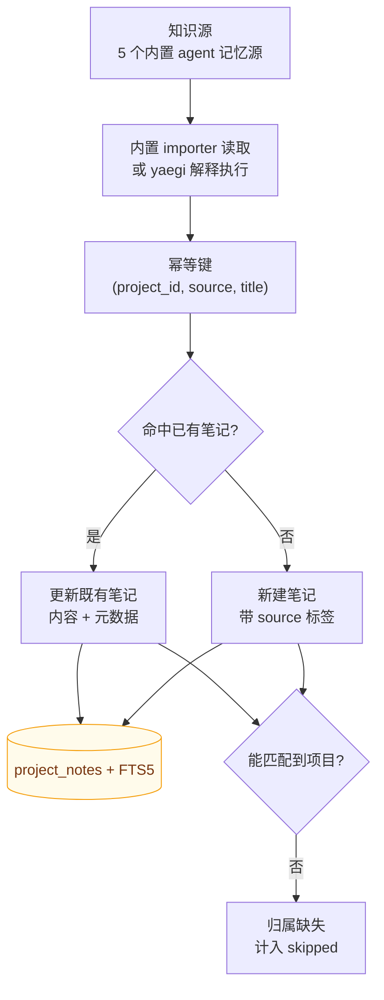

# 知识源导入

> ⚠️ **实验性**：插件系统接口可能变更，不作为平台扩展方向（见 [ADR-0006](../adr/0006-scope-freeze.md)）。

RepoNest 支持通过 yaegi 解释执行的 Go 脚本向知识库幂等导入文档。

读图：两条入口（内置 agent 记忆源、插件脚本）**汇入同一条 upsert 路径**，幂等性由三元组 `(project_id, source, title)` 保证。因此重复导入是**更新**而非重复创建——重新导入不会把知识库越堆越脏。写入后由触发器同步 FTS 索引，导入的文档立刻可被 `reponest_notes_search` 命中。

注意最后一条分支：**匹配不到项目的文档不会入库**，只计入 `skipped`。`openclaw` / `hermes` 未配置目标项目时全部落入此分支。

## 内置知识源

| 源 | 触发方式 | 读取路径 | 说明 |
|----|---------|---------|------|
| `claude` | **自动** | `~/.claude/projects/*/memory/*.md` | 跳过 `MEMORY.md`；单文件超 100 KB 跳过 |
| `codex` | 手动 | `~/.codex/sessions/**/rollout-*.jsonl`、`~/.codex/archived_sessions/**` | 取每场会话的首条用户指令 + 末条助手回复 |
| `opencode` | 手动 | `$XDG_DATA_HOME`/`~/.local/share/opencode/storage/session/**/*.json` | 会话标题 + 摘要 |
| `openclaw` | 手动 | `~/.openclaw-autoclaw/workspace/*.md` | 仅单层，不递归；**需配置目标项目** |
| `hermes` | 手动 | `$HERMES_HOME`/`~/.hermes/memories/{MEMORY,USER}.md` | **需配置目标项目** |
| `cursor` | 手动 | `<config>/Cursor/User/globalStorage/state.vscdb`（`CURSOR_STATE_DB` 可覆盖） | 只读；取首条提问 + 末条回复；格式不认识则**整源报错** |

「自动」指应用启动时随 `auto_import` 一起跑（**默认关**，需在 **设置 → 插件** 显式开启）；「手动」指只在 **设置 → 插件** 点该源时才导入 —— 这类源多为原始会话转录，量大且噪音高，不适合每次启动全量重扫。

### 项目归属

`claude` / `codex` / `opencode` / `cursor` 四个源自带项目线索（Claude 的 `-Users-x-Work-Foo` 目录名、会话的 `cwd`、OpenCode 的 `directory`、Cursor 的 `workspaceId → workspaceStorage/<id>/workspace.json` 里的 folder 路径），取**路径最后一段**后按三级规则匹配：项目名精确匹配 → 仓库路径以该段结尾 → 项目名包含该段。匹配不上则该文档归属为空、计入 `skipped`，**不会**落到某个「未分类」项目。

`openclaw` 与 `hermes` 的文件本身不含项目线索，因此目标项目由配置键指定：

| 配置键 | 作用 |
|--------|------|
| `openclaw_project` | openclaw 笔记归属的项目名或项目 ID |
| `hermes_project` | hermes 笔记归属的项目名或项目 ID |

> ⚠️ **未配置时这两个源会静默跳过**：导入不报错，但全部文档计入 `skipped`，一条笔记都不会生成。设置页看不到原因，只能从 `skipped` 计数察觉。首次使用这两个源前请先设置对应配置键。

### 导入统计

每次导入返回 `{created, updated, skipped}`：

- `created` — 新建的笔记数
- `updated` — 幂等命中并更新的笔记数（重复导入时全部落在这里）
- `skipped` — **未匹配到项目**的文档数，以及超限/无法解析的文件数

所以「重复导入一遍全部变成 `updated=6`、`created=0`」正是幂等生效的证据，而非没有实际数据。

启动自动导入可在 **设置 → 插件** 开关（`auto_import` 配置项，**默认关**：读别人工具的记忆文件并写进本库属隐私相关行为，必须显式授权；升级时旧库若为"开"会被一次性归零，见 CHANGELOG）。手动触发见设置页。

### headless 模式

`cmd/server`（`--port` 启动的独立 API 服务）会执行与桌面应用相同的启动流程，因此知识源注册与 `auto_import` 行为完全一致：通过 `/api/rpc` 调用 `GetKnowledgeSources`、`TriggerKnowledgeImport`、`TriggerAllKnowledgeImports` 均可正常使用。

## 幂等导入语义

运行时按 `(project_id, source, title)` upsert：重复导入**更新**既有笔记而非重复创建。
